<div align="center">

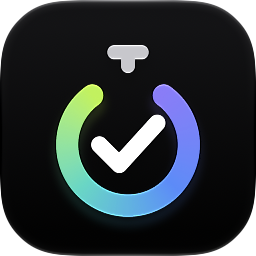

# Komodo

**A to-do list that collapses into a focus timer.**
Plan your day, press Start, and let the current task stay with you, above every app, until it's done.


<br>

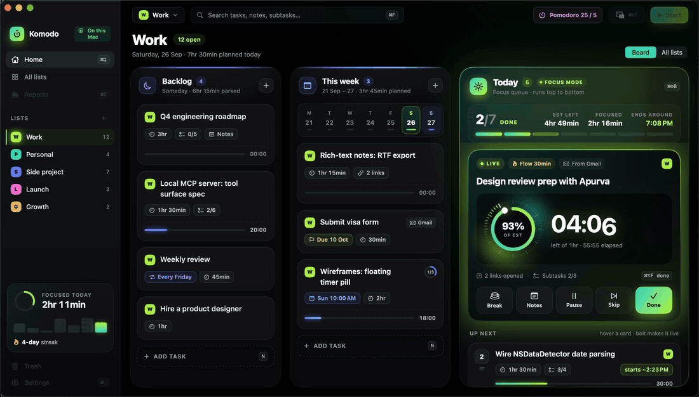

<sub>Recorded from the running app · <a href="docs/media/board.mp4">watch in full quality</a></sub>

</div>

---

## Why Komodo

Most to-do apps stop at the list. Komodo keeps going: the list becomes the timer.

> **Plan the day → Start → one task at a time → finish and review.**

- **One live task, always visible.** The task you're on floats above every app with its countdown, so you never lose the thread.
- **Estimates you can trust.** Every task has an estimate and every session is timed. Reports show where your day actually went.
- **Delight at the finish line, silence during the work.** Celebrations play on *Done*, never mid-task.
- **Your data stays yours.** No account, no server. Everything lives in SQLite on your Mac and exports as a zip at any time.

## Features

| | Feature | What it does | Status |
| :-: | --- | --- | :-: |
| 🎨 | **Obsidian Spectrum design system** | True-black canvas, cursor spotlight on every surface, border beam, focus dial and odometer digits, all honoring Reduce Motion | ✅ Available |
| 🧩 | **Component library** | Buttons, chips, fields, task and queue cards, the live task card with its control bar, break card, day meter, toasts and banners | ✅ Available |
| 🗂️ | **Board with time temperature** | Backlog (cold), This week (warm) and Today (hot) on its own glowing stage. Drag and drop, quick add that reads estimates like `Write spec 45m`, a live task with projected start times, and Undo. Everything is saved on your Mac | ✅ Available |
| 🏷️ | **Lists** | Make a list for every project with its own name, color and letter or emoji badge. Drag to reorder, rename or recolor it, archive it when it's done, or delete it to Trash with everything in it | ✅ Available |
| 🔎 | **Task inspector** | Everything about a task in one side panel: list, estimate, time taken, schedule, repeat, subtasks, rich-text notes and every focus session | ✅ Available |
| ⏱️ | **Focus mode** | Work top-down through Today in a Focus Panel docked to the screen edge: a live focus dial, breaks that breathe with you, and the queue a click away | ✅ Available |
| 💊 | **Floating timer** | A 40 pt pill that stays above every app and every Space, drags anywhere, expands on hover, and scrolls long titles | ✅ Available |
| 🎉 | **Celebrations and day summary** | A burst, a chime and a random animated GIF on every Done, and "You won the day." when the queue is clear | ✅ Available |
| ✉️ | **Gmail → Calendar** | Finds meetings and deadlines in your email and adds them to Google Calendar. Never sends, deletes or changes email | 🚧 In development |
| 📅 | **Scheduling and repeats** | Pick a day, a time and a repeat in two steps. Recurring tasks get stable IDs, so nothing duplicates and a deleted copy stays gone | ✅ Available |
| 🔔 | **Menu bar, reminders and global shortcuts** | The live task's time in the menu bar, reminders that fire even with Komodo closed, and ⌘⇧B, ⌘⇧T and ⌘⇧P from any app | ✅ Available |
| ⚙️ | **Settings** | Every preference in one window that applies as you change it: the Dock, the panel's screen, Pomodoros, alerts and sounds, celebrations and shortcuts | ✅ Available |
| 🗑️ | **Trash and archive** | Deleted lists and tasks wait 30 days with Restore, and archived ones leave the Board but stay in your history | ✅ Available |
| 📊 | **Reports** | Work days, hours and your most productive hour, day and month; estimate accuracy week by week; hours by list; and every session and break, editable and exportable to PDF or CSV | ✅ Available |
| ⌨️ | **Keyboard first** | Command palette, quick add from anywhere and a shortcut for every action, global ones included | ✅ Available |
| 💾 | **Backup and restore** | One-click zip export, a daily automatic backup, and a restore that checks the file and saves your current data first | ✅ Available |
| 👋 | **First launch** | Three short intro screens, notifications, and the tasks you want to finish today, then a tip pointing at Start | ✅ Available |

## The Board

<p align="center">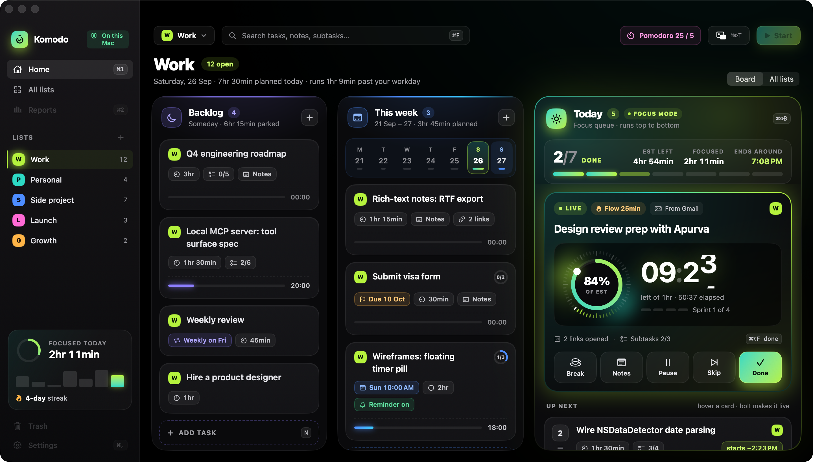</p>

- **Time has temperature.** Backlog is cold violet, This week is warm blue with a seven-day strip, and Today is hot, on its own stage.
- **Plan in seconds.** Type `Write spec 45m` and the estimate is filled in. Drag cards between columns, or use Space, ⌥↑ and ⌥↓.
- **Know when you'll be done.** Every queued task shows when it should start, the day meter shows when the day ends, and the header tells you whether it all fits before your workday is over.
- **One live task.** Start, pause, skip, take a break, or use the bolt on any card to switch. The dial and digits never drift, because time comes from the clock, not from counting ticks.

## The inspector

<p align="center">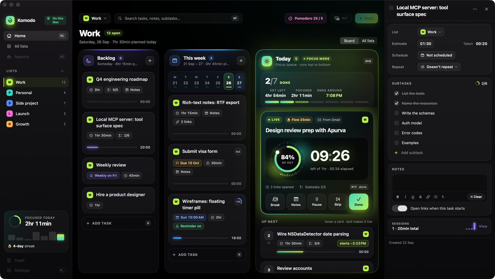</p>

- **Click any card** to see and edit everything about it. ⌘↑ and ⌘↓ step through tasks, and Esc closes.
- **Notes with real formatting.** Bold, lists and links, and the links open by themselves when the task goes live.
- **Honest time.** Every focus session is recorded, and time taken stays locked while the timer runs.

## Scheduling and quick add

<table>
  <tr>
    <td width="50%">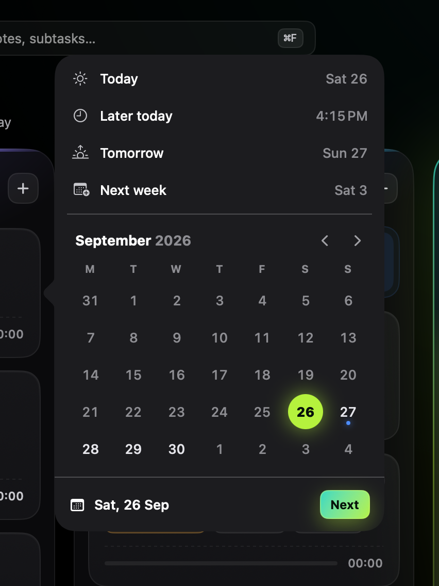</td>
    <td width="50%">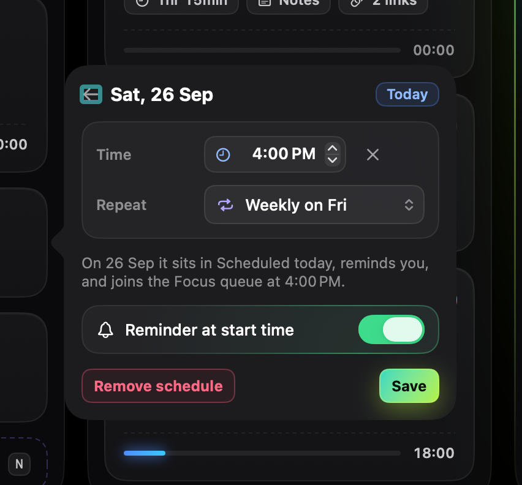</td>
  </tr>
  <tr>
    <td colspan="2">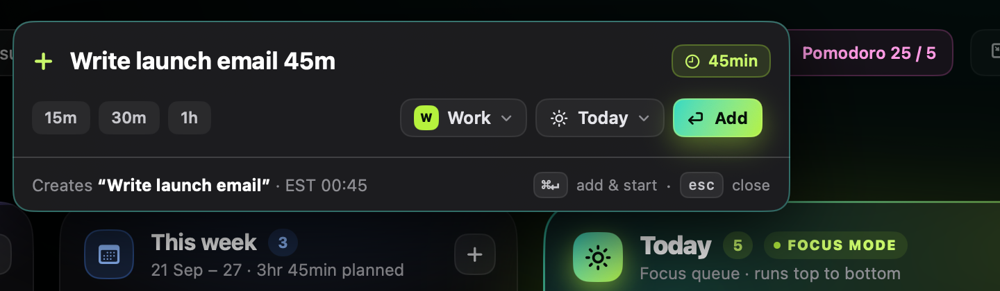</td>
  </tr>
</table>

- **Two steps to schedule.** Pick a day, then add a time and a repeat. Komodo tells you exactly what will happen on that day.
- **Repeats that behave.** Every day, weekdays, weekly, monthly, or a custom rule like "Every 2 weeks on Tue and Thu". Change a rule and choose whether this week's copies are replaced.
- **Quick add with ⌘⌥T.** Type `Write launch email 45m`, pick the list and column, and press Return, or ⌘Return to start it straight away.

## Focus mode

<table>
  <tr>
    <td width="30%">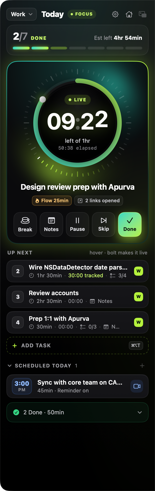</td>
    <td width="70%">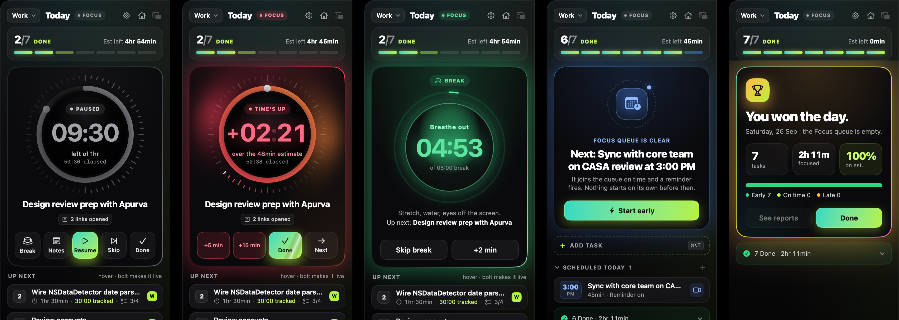</td>
  </tr>
</table>

- **One press to focus.** Start docks the Focus Panel to the edge of your screen and steps the Board aside. Home brings it back, with the task still running.
- **Every state at a glance.** The dial glows lime while you work, turns grey when paused and red with a shake when the estimate runs out, with +5 and +15 min one click away.
- **Breaks that breathe.** A green circle breathes four seconds in and four out while the break counts down. Nothing restarts until you say so.
- **The queue stays yours.** Add a task, finish one, or bolt any task live from the panel. When only timed tasks are left it waits calmly and starts each one on the minute, and when the queue is clear you've won the day.
- **Pomodoro sprints, your way.** Work counts toward 25-minute sprints and a break starts when one ends. Keep the task's estimate as the big number with the sprint beside it, or switch Sprint display to count the sprint itself in pink.
- **Quick Settings.** Sprint and break lengths, sprint display, the panel's side and sounds, from the gear.

<p align="center">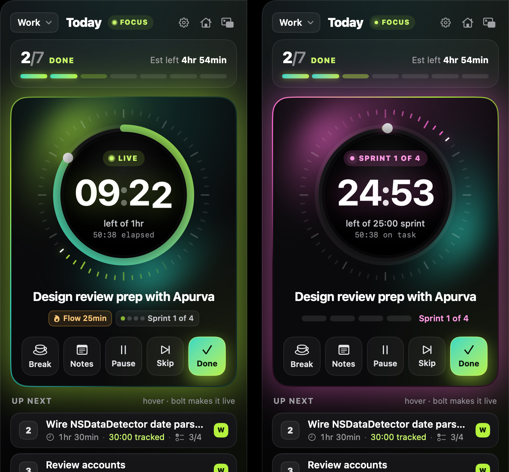</p>

## Floating timer and celebrations

<table>
  <tr>
    <td width="58%">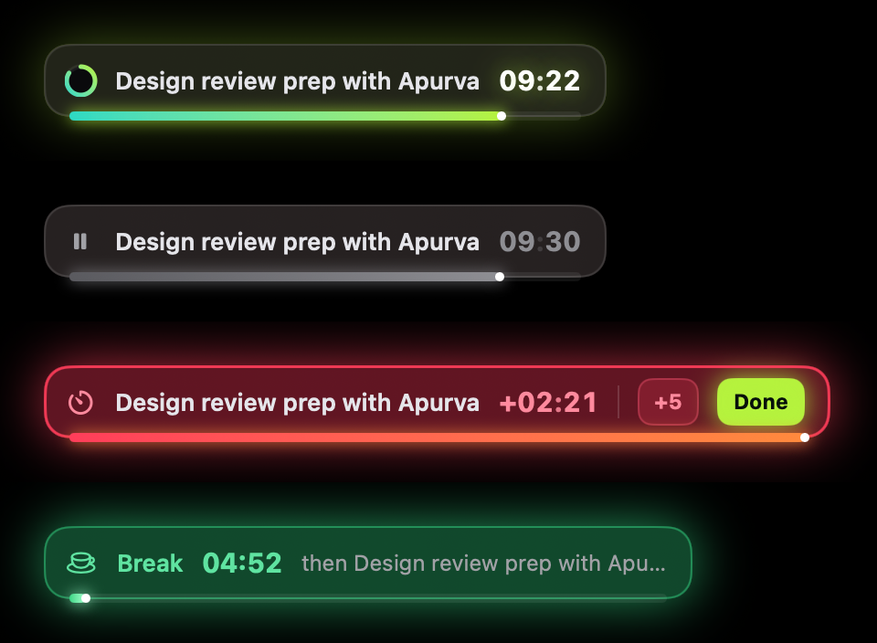</td>
    <td width="42%">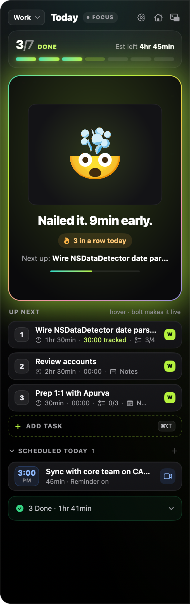</td>
  </tr>
</table>

- **Out of the way, never out of sight.** ⌘⇧T collapses the panel into a 40 pt pill that floats above every app and Space. Drag it anywhere; it remembers its spot on each display.
- **Hover for controls.** Pause, Done, Skip, Break, Notes and back to the panel slide in on a spring. At Time's Up it turns red with +5 and Done inline, and ⌘⇧P ripples it so you can find it.
- **A moment for every Done.** A confetti burst, a random animated GIF and a word on how you did against the estimate: "Nailed it. 12min early." The GIFs ship inside the app, so they work offline. The next task starts when it's over, never mid-celebration.

## Command palette

<p align="center">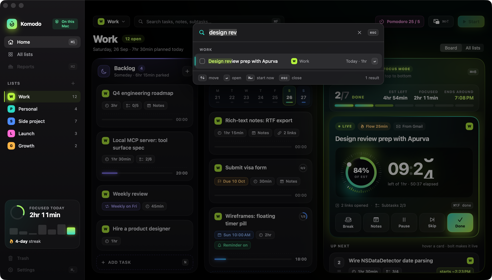</p>

- **⌘F finds anything.** Titles, notes and subtasks across every list, Done included, grouped by list with the match highlighted.
- **Return opens, ⌘Return starts.** No match? Create the task right there.
- **Type > for commands.** New Task, Start and more, from the keyboard.

## Settings

<p align="center">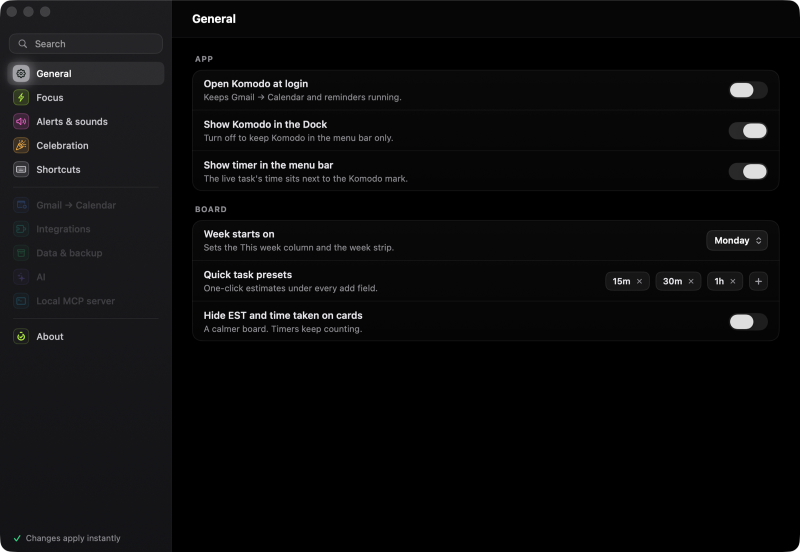</p>

<table>
  <tr>
    <td width="50%">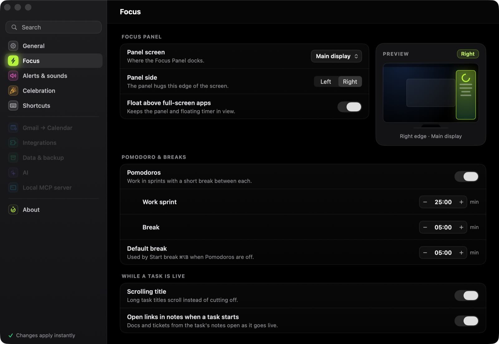</td>
    <td width="50%">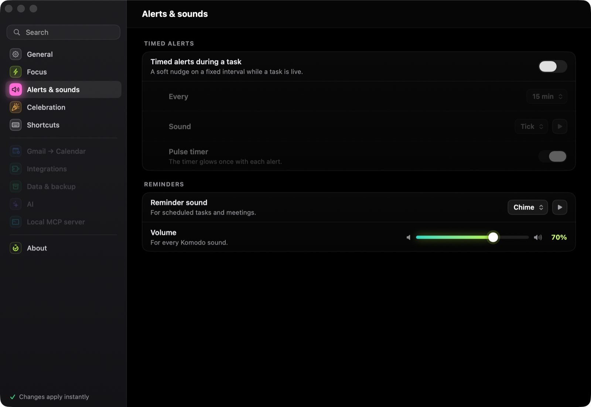</td>
  </tr>
  <tr>
    <td width="50%">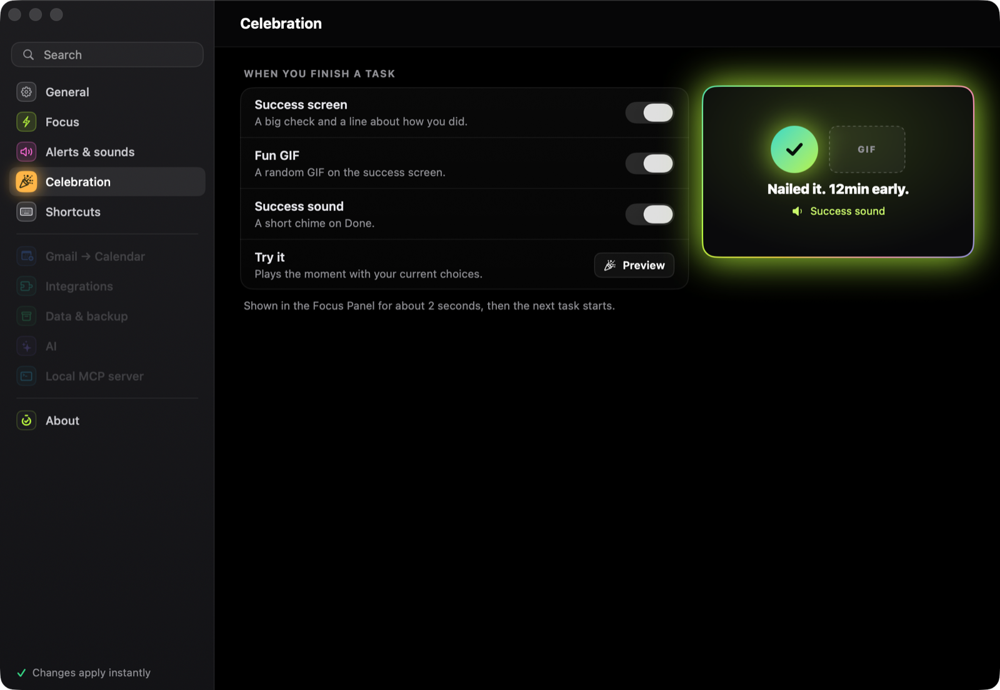</td>
    <td width="50%">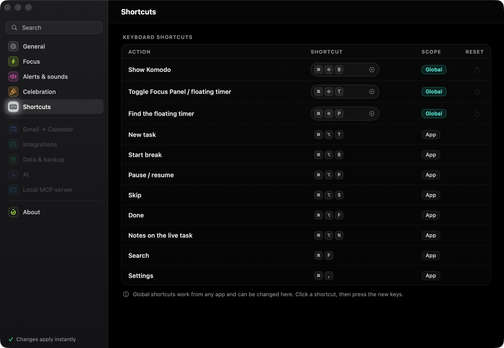</td>
  </tr>
</table>

- **Changes apply instantly.** No Save button: flip a switch and the Board, the panel and the timer follow at once. Quick Settings and Settings are two views of the same values.
- **Make it yours.** Keep Komodo in the Dock or only in the menu bar, dock the Focus Panel on any display, and pick the week's first day and your quick estimates.
- **Sounds with a preview.** Choose each sound, hear it with ▶, and set one volume for all of them. Timed alerts nudge you every few minutes while a task is live, if you want them.
- **Record your own shortcuts.** Click a global shortcut and press new keys. If another app already holds them, Komodo says so.

## Menu bar, reminders and shortcuts

- **Always a click away.** The Komodo mark lives in the menu bar and shows the time left while a task runs. Its menu pauses, finishes or skips the task, opens Komodo and Settings.
- **Reminders that fire on time.** A scheduled task reminds you when it starts, with Start now and Snooze 5 min, even when Komodo isn't running. When the estimate runs out with the panel hidden, Time's up offers +5 min and Done.
- **Global shortcuts.** ⌘⇧B shows Komodo, ⌘⇧T swaps the panel and the floating timer, and ⌘⇧P finds the timer, from any app.
- **Picks up where you left off.** Quit mid-task and the task is waiting, paused, when you come back. Even after a crash, only the time Komodo was really running counts.

## Your data, backed up

<p align="center">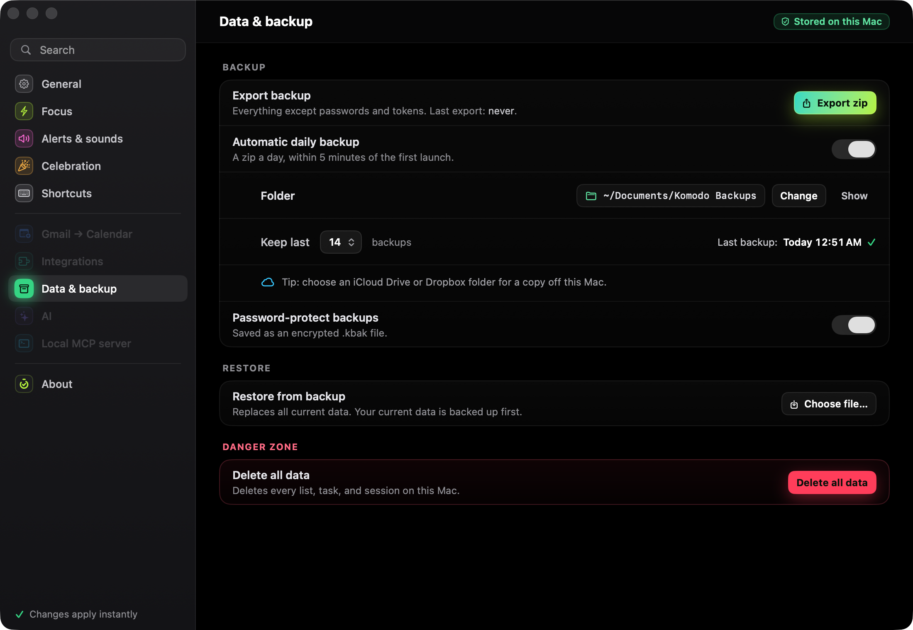</p>

<p align="center">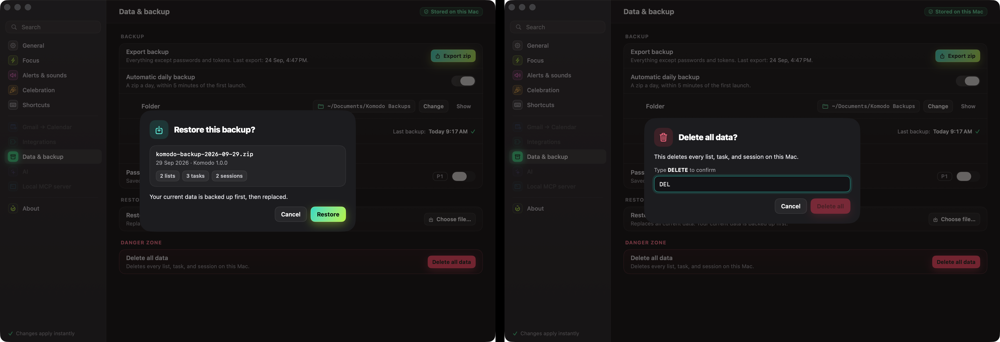</p>

- **One zip, everything in it.** Export zip saves a consistent copy of the database plus readable JSON and CSVs for spreadsheets. Passwords and tokens are never inside.
- **A backup every day.** Within minutes of the first launch each day, Komodo zips your data into a folder you choose and keeps the last 7, 14 or 30. Pick an iCloud Drive or Dropbox folder for a copy off your Mac.
- **Restores you can trust.** Komodo checks the zip before touching anything, refuses one from a newer version, and saves your current data first. The board comes back exactly as it was.
- **No accidents.** Delete all data waits until you type DELETE, and a restore from your last zip brings it all back.

## First launch

<p align="center">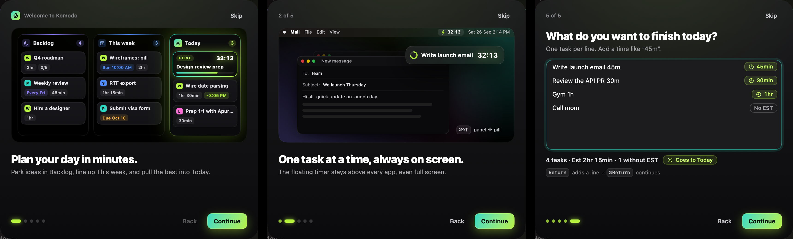</p>

- **Up and running in a minute.** Three short screens show the idea: plan, focus, win.
- **Notifications, asked once.** Allow them up front and choose Alerts so reminders keep their Start now and Snooze buttons.
- **Today, typed.** One task per line with a time like "45m". Each line shows its estimate as you type, and ⌘Return puts them all in Today with a tip pointing at Start.

## Lists

<table>
  <tr>
    <td width="50%">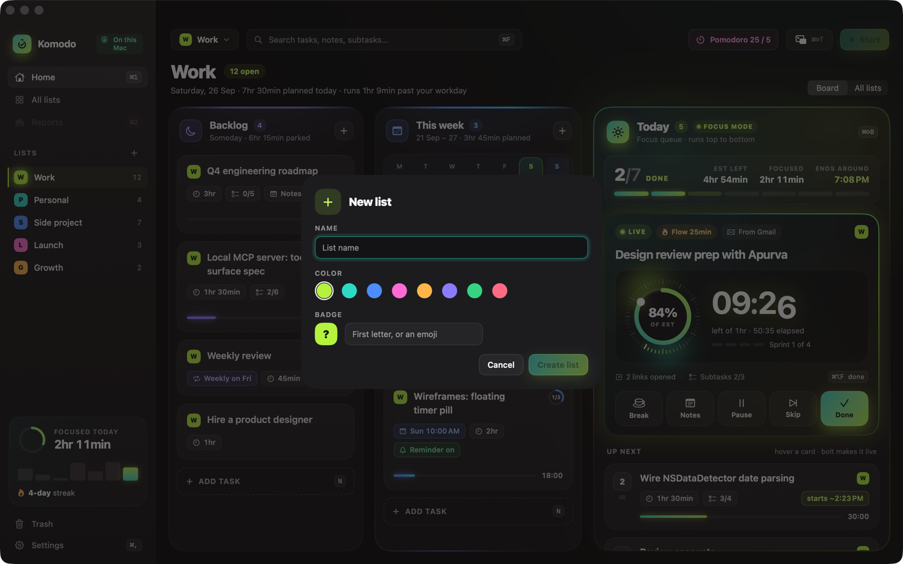</td>
    <td width="50%">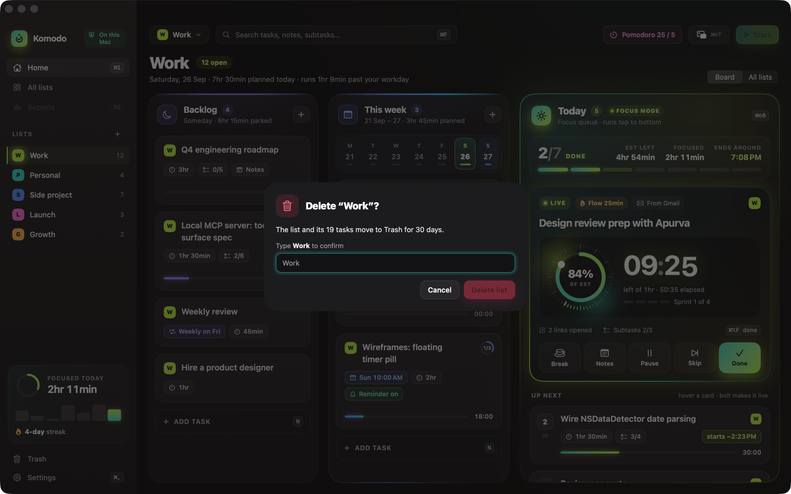</td>
  </tr>
</table>

- **A list per project.** Give it a name, one of eight colors and a badge: its first letter, or any emoji.
- **Right-click to manage.** Rename, change the color and badge, archive a finished project, or delete it.
- **Drag to reorder.** The sidebar keeps whatever order you give it.

## Reports

<p align="center">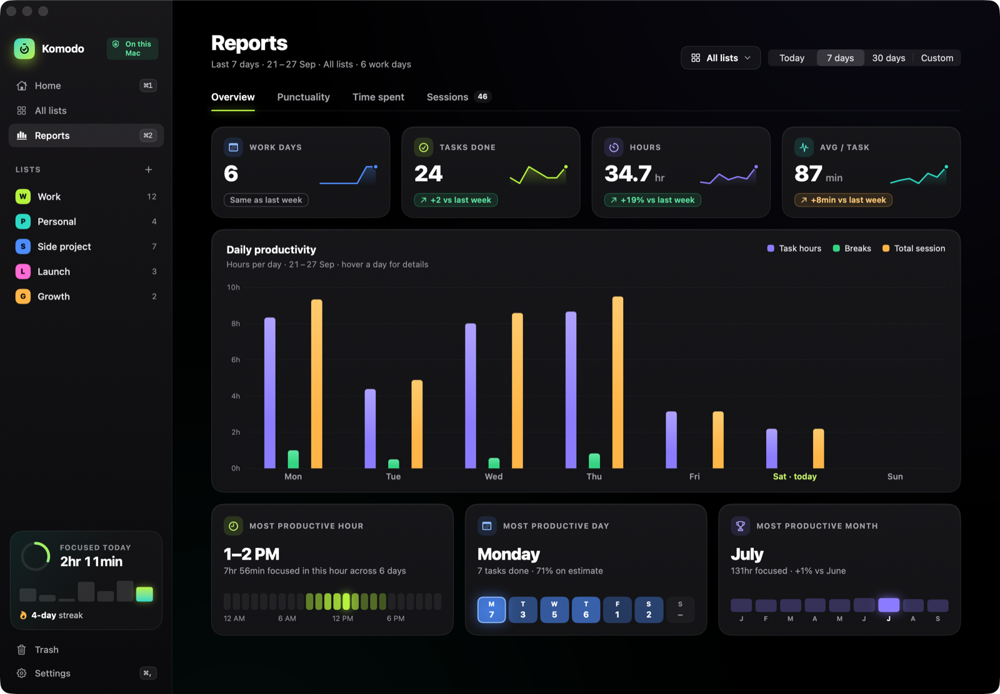</p>

<table>
  <tr>
    <td width="50%">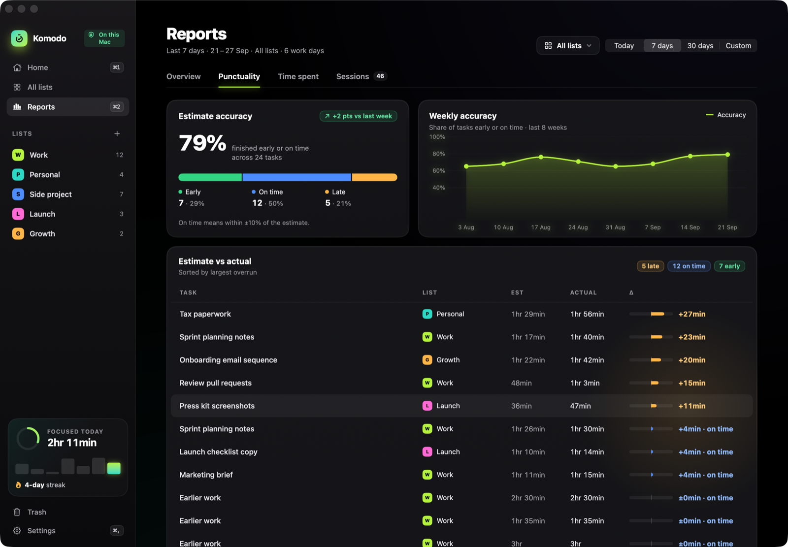</td>
    <td width="50%">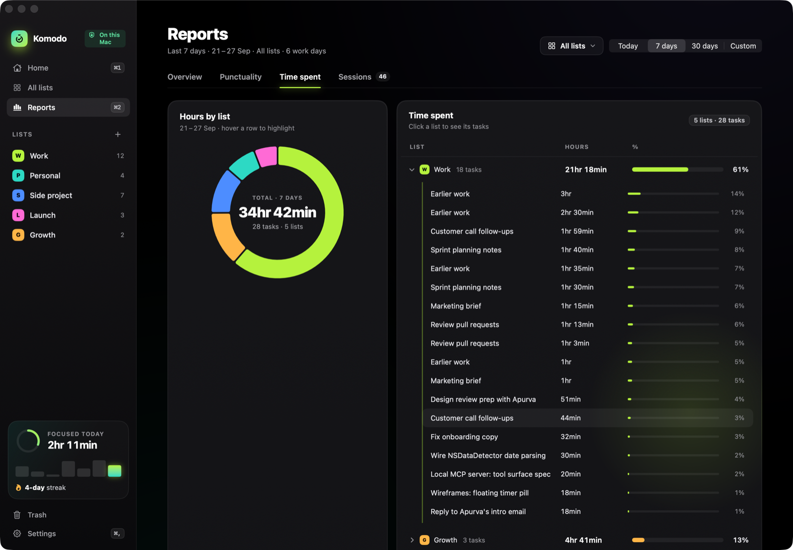</td>
  </tr>
</table>

<p align="center">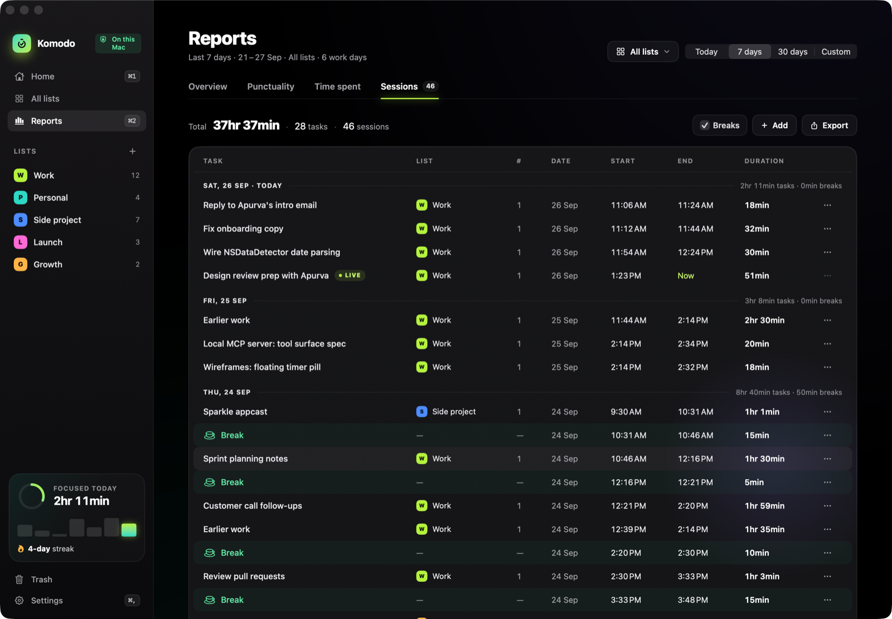</p>

- **See where the week went.** Work days, tasks done, hours and time per task, each against the week before, with the day-by-day bars behind them.
- **Know your best hours.** Your most productive hour, day and month, from the time you actually focused.
- **Get better at estimates.** How many tasks landed early, on time or late, how that's trending over eight weeks, and which tasks ran over most.
- **Every session, on the record.** Work and breaks a day at a time. Fix a session, log work you did away from your Mac, and export to PDF or CSV.
- **Filter anything.** One list or all of them, today, this week, the last 30 days or any range. Open with ⌘2.

## Trash

<p align="center">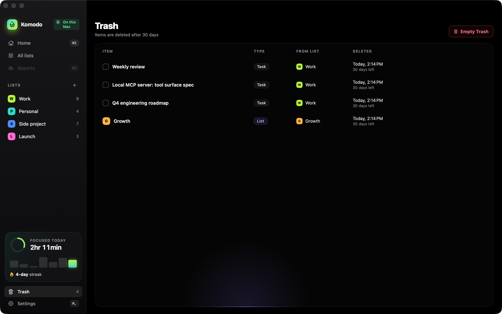</p>

- **Nothing is gone by accident.** Deleted lists and tasks wait 30 days, with the last three days in amber. Restore puts a task back where it was, and a list back in its place with all its tasks.
- **Deleting a list asks twice.** Type the list's name to confirm, then Undo is still one click away.
- **Archive, don't delete.** Archive a finished project, or a single task, and it leaves the Board but stays in your history.

## The design system

Komodo's look is **Obsidian Spectrum**: black is the canvas, color is earned, light follows your cursor, and time has a temperature. Every token, effect and component is built in SwiftUI and can be inspected live in the debug gallery.

<table>
  <tr>
    <td colspan="2">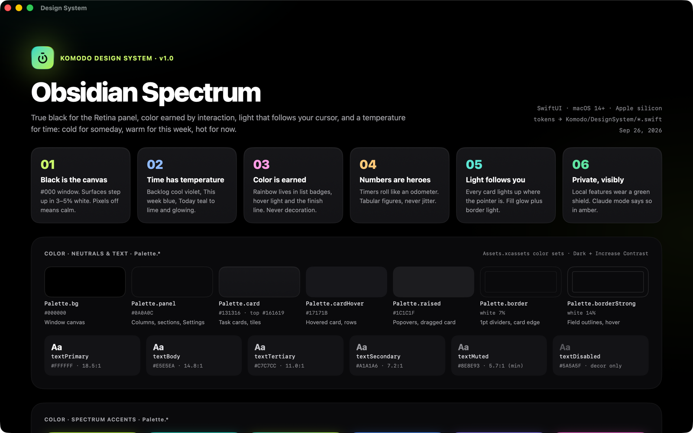</td>
  </tr>
  <tr>
    <td width="50%">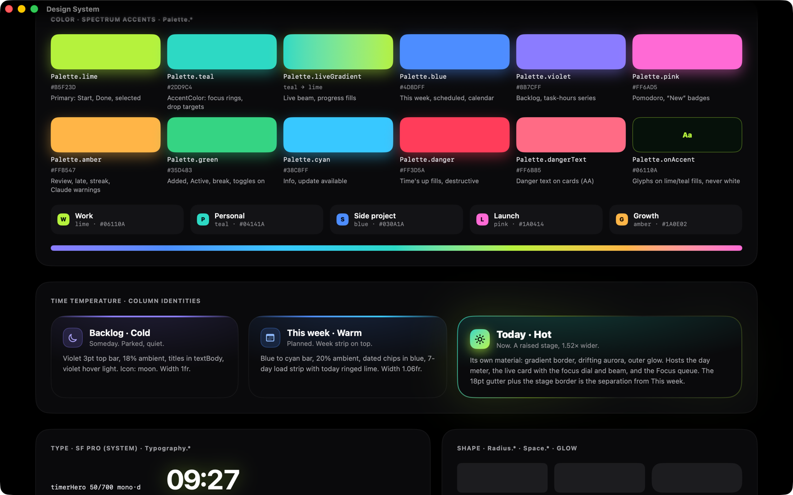</td>
    <td width="50%">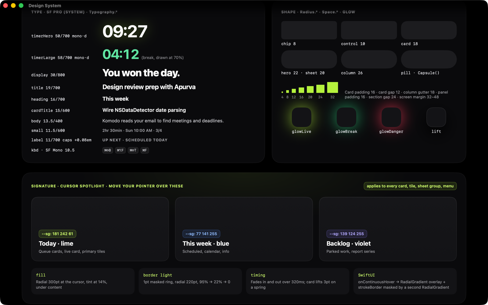</td>
  </tr>
  <tr>
    <td width="50%">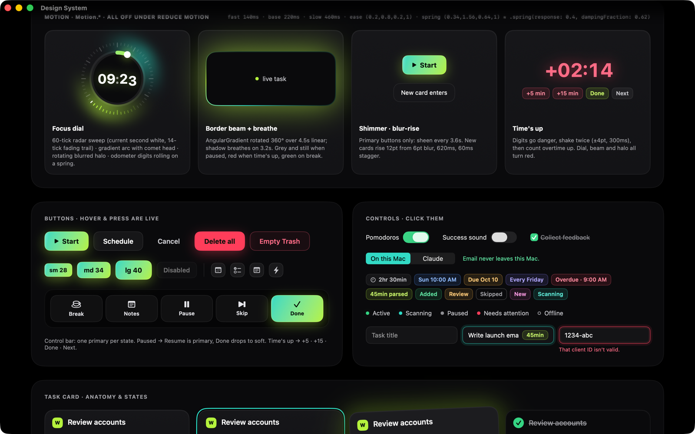</td>
    <td width="50%">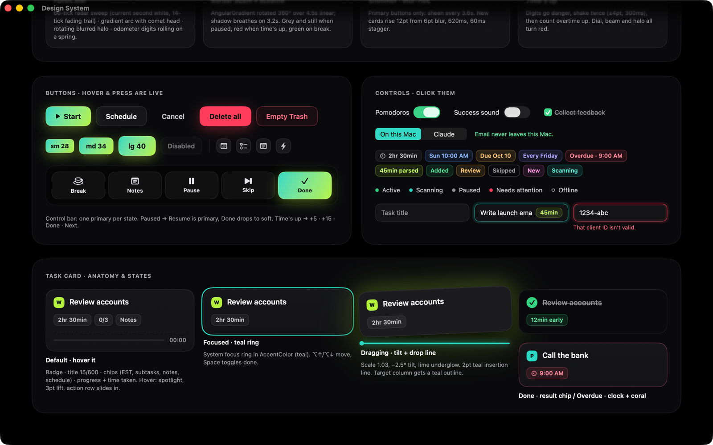</td>
  </tr>
</table>

<p align="center">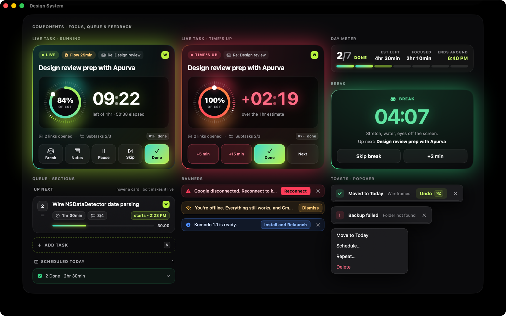</p>

<p align="center">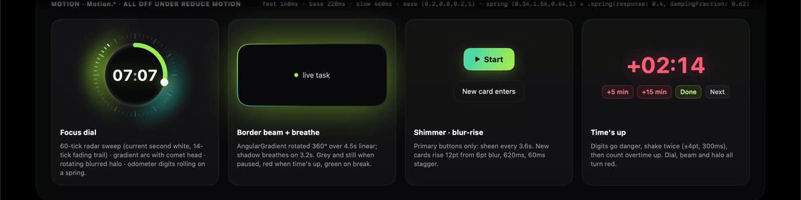</p>

**Signature effects**

- **Cursor spotlight.** Every card, tile, menu and notification lights up where the pointer is: a tinted glow plus a 1 pt border light.
- **Border beam.** A conic light travels around the live task every 4.5 s while its glow breathes. It turns grey when paused, red at Time's Up and green on a break.
- **Focus dial.** A 60-tick radar sweep, a progress arc with a comet head and a rotating halo, all driven by wall-clock time so it never drifts.
- **Odometer digits.** Timer digits roll like a mechanical counter, in tabular figures that never jitter.

## Built with

| Layer | Choice |
| --- | --- |
| App | Swift 6 with complete strict concurrency, SwiftUI, AppKit panels |
| Platform | macOS 14 Sonoma or later, Apple silicon only |
| Storage | SQLite on your Mac, no server |
| Core logic | `KomodoCore` Swift package, tested with Swift Testing |
| Project | Generated with XcodeGen, linted with swift-format |
| Celebration GIFs | [Animated Noto Emoji](https://googlefonts.github.io/noto-emoji-animation/) by Google, CC BY 4.0 |

## Getting started

```bash
brew install xcodegen
xcodegen generate
xcodebuild -scheme Komodo -destination 'platform=macOS,arch=arm64' build
(cd KomodoCore && swift test)
```

In a Debug build, **Debug → Design System Gallery** (⌥⇧⌘G) opens the gallery. You can also launch straight into it at any section (`principles`, `neutrals`, `accents`, `temperature`, `type`, `spotlight`, `motion`, `controls`, `cards`, `components`):

```bash
open Komodo.app --args -design-gallery -galleryScrollTo motion
```

Your board is saved on your Mac. To see the sample day exactly as designed (Saturday, Sep 26 at 2:14 PM), without touching your own tasks, launch a Debug build with:

```bash
open Komodo.app --args -sampleTime artboard
```

## Roadmap

- [x] Design tokens and asset-catalog color sets
- [x] Signature effects: spotlight, border beam, focus dial, odometer digits
- [x] Design system gallery
- [x] Components: buttons, chips, fields, task card, live task card, control bar, day meter, toasts, banners
- [x] Menu bar app, Settings, reminders and global shortcuts
- [x] Backup, restore and automatic daily backups
- [x] Onboarding
- [ ] Gmail → Calendar
- [x] Board: columns, drag and drop, quick add with estimates, the live task and its queue
- [x] Inspector, scheduling and repeats, and the Quick add panel
- [x] Saving to SQLite, on your Mac
- [x] Focus Panel and its states
- [x] Floating timer, celebrations, day summary, command palette
- [x] Trash and archive
- [x] Lists: create, rename, color and badge, reorder, archive, delete to Trash
- [x] Timed tasks join the queue on time, alerts that survive App Nap, and the away-from-your-Mac question
- [x] Reports and sessions

## Contributing

See [CONTRIBUTING.md](CONTRIBUTING.md) for the commit conventions and how this README is kept up to date, and
[CHANGELOG.md](CHANGELOG.md) for everything that has landed so far.
