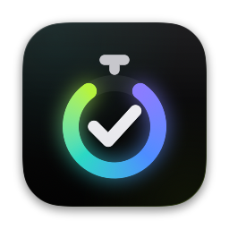

<div align="center">



# Komodo

**A to-do list that collapses into a focus timer.**
Plan your day, press Start, and let the current task stay with you, above every app, until it's done.


<br>


<sub>Recorded from the running app · <a href="docs/media/board.mp4">watch in full quality</a></sub>

</div>

---

## Why Komodo

Most to-do apps stop at the list. Komodo keeps going: the list becomes the timer.

> **Plan the day → Start → one task at a time → finish and review.**

- **One live task, always visible.** The task you're on floats above every app with its countdown, so you never lose the thread.
- **Estimates you can trust.** Every task has an estimate and every session is timed. Reports show where your day actually went.
- **Delight at the finish line, silence during the work.** Celebrations play on *Done*, never mid-task.
- **Your data stays yours.** No account, no server. Everything lives in SQLite on your Mac and exports as a zip at any time.

## Features

| | Feature | What it does | Status |
| :-: | --- | --- | :-: |
| 🎨 | **Obsidian Spectrum design system** | True-black canvas, cursor spotlight on every surface, border beam, focus dial and odometer digits, all honoring Reduce Motion | ✅ Available |
| 🧩 | **Component library** | Buttons, chips, fields, task and queue cards, the live task card with its control bar, break card, day meter, toasts and banners | ✅ Available |
| 🗂️ | **Board with time temperature** | Backlog (cold), This week (warm) and Today (hot) on its own glowing stage. Drag and drop, quick add that reads estimates like `Write spec 45m`, a live task with projected start times, and Undo | ✅ Available · saving to disk is next |
| ⏱️ | **Focus mode** | Work top-down through Today with a live focus dial, Pomodoro sprints, breaks and a docked Focus Panel | 🚧 In development |
| 💊 | **Floating timer** | A 40 pt pill that stays above every app and every Space, and expands on hover | 🚧 In development |
| 🎉 | **Celebrations and day summary** | A burst on every Done, and "You won the day." when the queue is clear | 🚧 In development |
| ✉️ | **Gmail → Calendar** | Finds meetings and deadlines in your email and adds them to Google Calendar. Never sends, deletes or changes email | 🚧 In development |
| 📅 | **Scheduling and repeats** | Schedules, due dates and recurring tasks with deterministic IDs, so nothing duplicates | 🚧 In development |
| 📊 | **Reports** | Estimated vs. actual time, punctuality, time spent and full session history | 🚧 In development |
| ⌨️ | **Keyboard first** | Command palette, quick add from anywhere and a shortcut for every action | 🚧 In development |
| 💾 | **Backup and restore** | One-click zip export and a verified restore, all on your Mac | 🚧 In development |

## The Board

<p align="center"></p>

- **Time has temperature.** Backlog is cold violet, This week is warm blue with a seven-day strip, and Today is hot, on its own stage.
- **Plan in seconds.** Type `Write spec 45m` and the estimate is filled in. Drag cards between columns, or use Space, ⌥↑ and ⌥↓.
- **Know when you'll be done.** Every queued task shows when it should start, and the day meter shows when the day ends.
- **One live task.** Start, pause, skip, take a break, or use the bolt on any card to switch. The dial and digits never drift, because time comes from the clock, not from counting ticks.

## The design system

Komodo's look is **Obsidian Spectrum**: black is the canvas, color is earned, light follows your cursor, and time has a temperature. Every token, effect and component is built in SwiftUI and can be inspected live in the debug gallery.

<table>
  <tr>
    <td colspan="2"></td>
  </tr>
  <tr>
    <td width="50%"></td>
    <td width="50%"></td>
  </tr>
  <tr>
    <td width="50%"></td>
    <td width="50%"></td>
  </tr>
</table>

<p align="center"></p>

<p align="center"></p>

**Signature effects**

- **Cursor spotlight.** Every card, tile, menu and notification lights up where the pointer is: a tinted glow plus a 1 pt border light.
- **Border beam.** A conic light travels around the live task every 4.5 s while its glow breathes. It turns grey when paused, red at Time's Up and green on a break.
- **Focus dial.** A 60-tick radar sweep, a progress arc with a comet head and a rotating halo, all driven by wall-clock time so it never drifts.
- **Odometer digits.** Timer digits roll like a mechanical counter, in tabular figures that never jitter.

## Built with

| Layer | Choice |
| --- | --- |
| App | Swift 6 with complete strict concurrency, SwiftUI, AppKit panels |
| Platform | macOS 14 Sonoma or later, Apple silicon only |
| Storage | SQLite on your Mac, no server |
| Core logic | `KomodoCore` Swift package, tested with Swift Testing |
| Project | Generated with XcodeGen, linted with swift-format |

## Getting started

```bash
brew install xcodegen
xcodegen generate
xcodebuild -scheme Komodo -destination 'platform=macOS,arch=arm64' build
(cd KomodoCore && swift test)
```

In a Debug build, **Debug → Design System Gallery** (⌥⇧⌘G) opens the gallery. You can also launch straight into it at any section (`principles`, `neutrals`, `accents`, `temperature`, `type`, `spotlight`, `motion`, `controls`, `cards`, `components`):

```bash
open Komodo.app --args -design-gallery -galleryScrollTo motion
```

The Board runs on sample data for now. To see it exactly as designed (Saturday, Sep 26 at 2:14 PM), launch with:

```bash
open Komodo.app --args -sampleTime artboard
```

## Roadmap

- [x] Design tokens and asset-catalog color sets
- [x] Signature effects: spotlight, border beam, focus dial, odometer digits
- [x] Design system gallery
- [x] Components: buttons, chips, fields, task card, live task card, control bar, day meter, toasts, banners
- [ ] Menu bar app, Settings, Gmail → Calendar, backup
- [x] Board: columns, drag and drop, quick add with estimates, the live task and its queue (in-memory for now)
- [ ] Inspector, scheduling, and saving to SQLite
- [ ] Focus Panel, floating timer, celebrations, day summary, command palette
- [ ] Reports, Trash, recurring tasks

## Contributing

See [CONTRIBUTING.md](CONTRIBUTING.md) for the commit conventions and how this README is kept up to date, and
[CHANGELOG.md](CHANGELOG.md) for everything that has landed so far.
