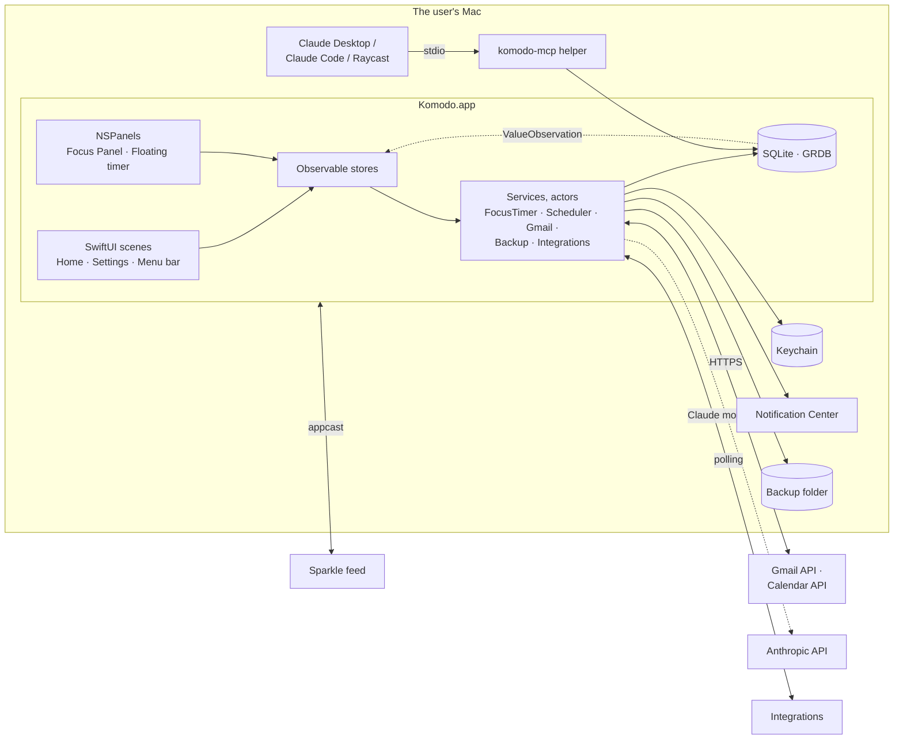
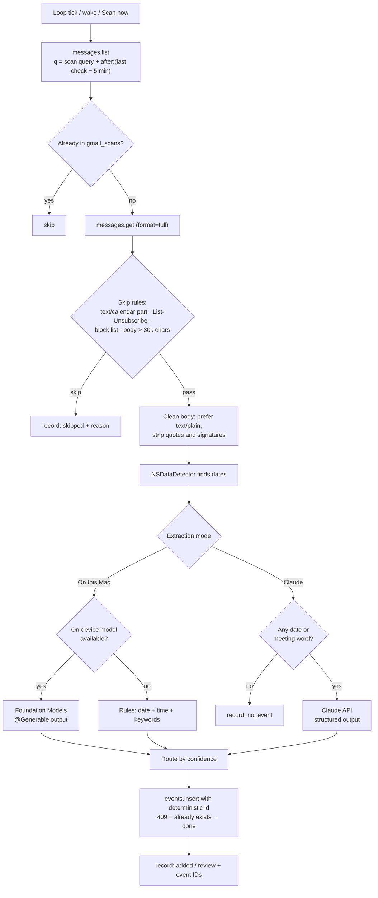

# Komodo: Architecture

> A native macOS app built with Swift and SwiftUI, for Apple silicon on macOS 14 Sonoma or later.
> Local-only: there is no Komodo server. All data stays on the Mac, and backups are zip files.
> Features: [FEATURES.md](./FEATURES.md) · UI: [DESIGN_SYSTEM.md](./DESIGN_SYSTEM.md)

---

## 1. Constraints

| Constraint | Consequence |
| --- | --- |
| macOS 14+ on Apple silicon only | arm64-only build. SwiftUI with the Observation framework (`@Observable`), plus AppKit where SwiftUI falls short: floating panels, the rich-text editor, animated GIFs |
| No Komodo backend | SQLite on the Mac is the only database. The network is used only for Google, connected integrations, Claude (opt-in), and update checks |
| Gmail → Calendar runs unattended | The app keeps running in the menu bar after its windows close, and catches up on launch and wake |
| No duplicate tasks or events | Deterministic IDs for recurring instances and calendar events |
| Private by default | Tokens live in the Keychain. Email bodies are never stored. Processing happens on the Mac unless Claude is switched on |

## 2. Tech stack

| Layer | Choice |
| --- | --- |
| Language | Swift 6, with complete strict-concurrency checking |
| UI | SwiftUI + Observation. AppKit for `NSPanel`, `NSTextView`, and `NSImageView` |
| Persistence | SQLite via **GRDB.swift** |
| Charts | Swift Charts |
| Networking | `URLSession` + `Codable` |
| Google sign-in | `ASWebAuthenticationSession` + PKCE (CryptoKit) |
| Secrets | Keychain (Security framework) |
| Date detection | `NSDataDetector` |
| On-device AI | Foundation Models framework (macOS 26+, with Apple Intelligence on) |
| Cloud AI (opt-in) | Claude API over `URLSession` (Anthropic has no official Swift SDK) |
| Speech (P2) | Speech framework, on-device recognition |
| Notifications | UserNotifications |
| Launch at login | ServiceManagement (`SMAppService`) |
| Global shortcuts | **KeyboardShortcuts** |
| Updates | **Sparkle 2** |
| Zip | `/usr/bin/ditto`, which ships with macOS |
| PDF export | `ImageRenderer` |
| Logging | `os.Logger` |
| Tests | Swift Testing |
| Lint and format | `swift-format`, which ships with the Swift toolchain |
| Local MCP server (P1) | **MCP Swift SDK** |

**Third-party packages.** Everything else is an Apple framework.

| Package | Why | Adds (approx.) | Alternative |
| --- | --- | --- | --- |
| GRDB.swift | Exact SQL: upserts, `VACUUM INTO` backups, migrations, change observation | ~3 MB | SwiftData (0 MB), with less control over upserts and file-level backups |
| KeyboardShortcuts | Global hotkeys plus a recorder view for remapping them | < 1 MB | A ~100-line Carbon `RegisterEventHotKey` wrapper and a custom recorder |
| Sparkle | Signed auto-updates outside the Mac App Store | ~3 MB | A "Check for updates" item that opens the download page |
| MCP Swift SDK (P1) | The stdio MCP server | ~1 MB | Hand-written JSON-RPC over stdio |

Sizes are approximate; check the archived app size when adding a package. The whole app is expected to be about 20 MB.

## 3. System overview



## 4. App structure

### 4.1 Scenes and windows

| Surface | Implementation |
| --- | --- |
| Home window | `Window("Komodo", id: "home")` with a `NavigationSplitView` (sidebar + board), a unified toolbar, and `.inspector` for task detail |
| Settings | The `Settings` scene (⌘, comes for free), with its own `NavigationSplitView` |
| Menu bar | `MenuBarExtra(isInserted:)` in menu style. The label shows the running timer with `.monospacedDigit()` |
| Focus Panel | An `NSPanel` with `.nonactivatingPanel`, 340 pt wide, the full `visibleFrame` height, docked left or right, hosting SwiftUI through `NSHostingView` |
| Floating timer | An `NSPanel` with `[.nonactivatingPanel, .borderless]`, `level = .floating`, `collectionBehavior = [.canJoinAllSpaces, .fullScreenAuxiliary]`, `isMovableByWindowBackground = true`, and a clear background |
| Onboarding | A sheet on the Home window at first launch |

- An `@NSApplicationDelegateAdaptor` owns the panels and the app lifecycle. `applicationShouldTerminateAfterLastWindowClosed` returns `false`, so the app keeps running in the menu bar.
- **Dock icon toggle:** `NSApp.setActivationPolicy(.regular)` or `.accessory`. The Dock menu comes from `applicationDockMenu(_:)`.
- **Menus:** SwiftUI `.commands` (`CommandMenu("Focus")`, `CommandGroup(replacing: .newItem)`). SwiftUI supplies the standard Edit menu.
- **URL scheme:** `komodo://start?task=<id>`, handled with `.onOpenURL`. The MCP helper uses it to start a task.
- **Panels** re-dock on `NSApplication.didChangeScreenParametersNotification`. The floating timer's position is saved per display (`NSScreenNumber`) and clamped to the visible frame.

### 4.2 State and data flow

```
View ──action──▶ Store (@MainActor @Observable) ──▶ Repository (GRDB write) ──▶ SQLite
  ▲                                                                              │
  └────────── store properties ◀── ValueObservation (async sequence) ◀───────────┘
```

| State | Lives in | Read via |
| --- | --- | --- |
| Lists, tasks, subtasks, sessions, settings, Gmail activity | SQLite | `@Observable` stores fed by GRDB `ValueObservation` |
| Live timer | `FocusTimer` (`@MainActor @Observable`) | Views compute the time inside `TimelineView(.periodic(from: .now, by: 1))` from `startedAt` |
| View-only state: selection, sheets, drag, search text | `@State`, or small `@Observable` UI models in the environment | none |
| Derived values: column, time taken, progress, day EST | Computed properties in `KomodoCore` | Never through `onChange` side effects |

### 4.3 Focus timer

The timer is a pure reducer in `KomodoCore`, implementing the state machine in FEATURES §4.10.

```swift
enum TimerState: Equatable, Sendable {
    case idle
    case running(taskID: String, sessionID: String, startedAt: Date, accumulated: Duration, mode: TimerMode)
    case paused(taskID: String, accumulated: Duration)
    case onBreak(taskID: String, endsAt: Date)
}
```

- **Elapsed time** is `accumulated + (now − startedAt)`. `TimelineView` redraws once a second. Nothing counts ticks, so the clock can't drift or stall.
- **Redraws off screen:** SwiftUI keeps running the views of an ordered-out window, so every one-second timeline takes its cadence from `Motion.tick(isMoving:isOffscreen:)`, and Home, the Focus Panel and the floating timer set the `isOffscreen` environment value from the store's focus surface. A window Focus mode set aside redraws hourly instead of every second.
- **Sessions:** every transition writes the `sessions` row, and a heartbeat updates `heartbeat_at` every 30 s.
- **Crash recovery:** an open session is closed at its last heartbeat, and the user is asked "Resume *task*?".
- **Sleep:** `NSWorkspace.willSleepNotification` / `didWakeNotification`. After a gap of more than 5 min the app asks "You were away 47 min. Count it or discard it?"
- **Reliable alerts:** Time's Up, sprint end, and break end are also scheduled as local notifications (`UNTimeIntervalNotificationTrigger`) when they start, so they fire on time even if the app is napping. They're cancelled on Pause or Done.
- **App Nap:** while a timer runs, `ProcessInfo.processInfo.beginActivity(options: .userInitiatedAllowingIdleSystemSleep, reason:)` keeps App Nap away. The activity ends when the timer stops.

### 4.4 Background work

| Job | Mechanism | Interval |
| --- | --- | --- |
| Day rollover | `.NSCalendarDayChanged`, `.NSSystemTimeZoneDidChange`, and wake notifications | On event |
| Gmail scan | A loop in the `GmailService` actor: `Task.sleep(for: .seconds(120), tolerance: .seconds(20))`, plus an immediate run on wake and app activation | 2 min (macOS may stretch this while the app is idle) |
| Calendar import (P1) | EventKit: `.EKEventStoreChanged`, `.NSCalendarDayChanged`, launch, and Sync now (`CalendarSync`) | On event |
| Integration polls (P2) | Same loop pattern | 5–10 min per connection |
| Daily backup, Trash purge | `NSBackgroundActivityScheduler` | 24 h |
| Reminders | `UNCalendarNotificationTrigger` for the next 50 scheduled tasks, rescheduled on every change and at day rollover | Exact, even while the app isn't running |

Each job backs off exponentially on failure (1, 2, 4 … up to 30 min). One failing job never blocks the others.

## 5. Data model (SQLite, GRDB migrations)

```sql
CREATE TABLE lists (
  id TEXT PRIMARY KEY, name TEXT NOT NULL, color TEXT NOT NULL, icon TEXT,
  rank TEXT NOT NULL, archived_at INTEGER,
  updated_at INTEGER NOT NULL, deleted_at INTEGER          -- deleted_at = in Trash
);

CREATE TABLE tasks (
  id TEXT PRIMARY KEY,
  list_id TEXT NOT NULL REFERENCES lists(id),
  title TEXT NOT NULL,
  bucket TEXT NOT NULL CHECK (bucket IN ('backlog','week','today')), -- only used when unscheduled
  rank TEXT NOT NULL,                  -- fractional index: reorder by writing one row
  est_min INTEGER,
  notes_rtf BLOB, notes_text TEXT,     -- RTF for the editor, plain text for search and export
  scheduled_date TEXT,                 -- 'YYYY-MM-DD' local
  scheduled_time TEXT,                 -- 'HH:MM' local; NULL = all day
  recurrence_id TEXT REFERENCES recurrences(id),
  occurrence_date TEXT,
  completed_at INTEGER, archived_at INTEGER,
  auto_open_links INTEGER NOT NULL DEFAULT 1,
  updated_at INTEGER NOT NULL, deleted_at INTEGER
);

CREATE TABLE subtasks (
  id TEXT PRIMARY KEY, task_id TEXT NOT NULL REFERENCES tasks(id),
  title TEXT NOT NULL, done INTEGER NOT NULL DEFAULT 0, rank TEXT NOT NULL,
  updated_at INTEGER NOT NULL, deleted_at INTEGER
);

CREATE TABLE recurrences (
  id TEXT PRIMARY KEY, parent_task_id TEXT NOT NULL,
  freq TEXT NOT NULL CHECK (freq IN ('day','week','month','year')),
  interval INTEGER NOT NULL DEFAULT 1, weekdays TEXT, month_day INTEGER,
  starts_on TEXT NOT NULL, ends_on TEXT, updated_at INTEGER NOT NULL
);

CREATE TABLE sessions (
  id TEXT PRIMARY KEY, task_id TEXT NOT NULL,
  kind TEXT NOT NULL CHECK (kind IN ('work','break')),
  mode TEXT NOT NULL CHECK (mode IN ('est','pomodoro','track','manual')),
  started_at INTEGER NOT NULL, ended_at INTEGER, heartbeat_at INTEGER,
  updated_at INTEGER NOT NULL
);

CREATE TABLE connections (             -- one row per connected account; tokens live in the Keychain
  id TEXT PRIMARY KEY, provider TEXT NOT NULL, account_email TEXT,
  settings TEXT NOT NULL,              -- JSON, decoded per provider
  status TEXT NOT NULL CHECK (status IN ('active','reauth_required','paused')),
  last_checked_at INTEGER, created_at INTEGER NOT NULL
);

CREATE TABLE gmail_scans (             -- never any email content
  message_id TEXT PRIMARY KEY, thread_id TEXT NOT NULL, received_at INTEGER NOT NULL,
  outcome TEXT NOT NULL CHECK (outcome IN ('added','review','no_event','skipped','error')),
  reason TEXT, event_ids TEXT,         -- JSON array of Calendar event IDs
  mode TEXT NOT NULL CHECK (mode IN ('mac','claude')), processed_at INTEGER NOT NULL
);

CREATE TABLE external_links (
  task_id TEXT NOT NULL, connection_id TEXT NOT NULL, external_id TEXT NOT NULL,
  external_updated_at REAL,            -- as built: seconds, like every other instant
  snapshot TEXT NOT NULL,              -- the synced fields as both sides last agreed
  PRIMARY KEY (connection_id, external_id)
);

CREATE TABLE preferences (key TEXT PRIMARY KEY, value TEXT NOT NULL, updated_at INTEGER NOT NULL);
```

- **Records** are Swift structs conforming to `Codable, FetchableRecord, PersistableRecord, Identifiable, Sendable`.
- **Derived, never stored:** time taken (the sum of work sessions), the column, and the progress dial.
- **IDs:** normal rows use `UUID().uuidString`. Recurring children use a UUID derived from a SHA-1 hash (CryptoKit `Insecure.SHA1`) of `recurrenceID:occurrenceDate`. Regenerating a week, or restoring a backup, can't duplicate them.
- **Recurring generation:** `generateWeek(_:weekStart:)` is a pure function in `KomodoCore`, applied with `INSERT … ON CONFLICT(id) DO NOTHING` on launch, at day rollover, and after edits.
- **Trash:** rows with `deleted_at` show in Trash for 30 days, then the daily job purges them.

## 6. Gmail → Calendar pipeline

The behavior is specified in FEATURES §4.0.



### 6.1 Google sign-in
1. `ASWebAuthenticationSession` opens Google's consent page with PKCE (S256; the verifier comes from `SecRandomCopyBytes` and is hashed with CryptoKit `SHA256`).
2. The OAuth client is Google's **iOS** client type, which macOS apps use. It's tied to the app's bundle ID, and its redirect is `com.googleusercontent.apps.<CLIENT_ID>:/oauth2redirect`, registered as a URL type in Info.plist. It needs no client secret.
3. The code is exchanged at `https://oauth2.googleapis.com/token` with `URLSession`.
4. The refresh token goes in the Keychain (`kSecClassGenericPassword`, service `app.komodo.google`, `kSecAttrAccessibleAfterFirstUnlockThisDeviceOnly`). Access tokens live in memory only.

| Scope | Why | Google's classification |
| --- | --- | --- |
| `https://www.googleapis.com/auth/gmail.readonly` | Read message bodies. `gmail.metadata` can't see bodies | **Restricted** ([Gmail scopes](https://developers.google.com/workspace/gmail/api/auth/scopes)) |
| `https://www.googleapis.com/auth/calendar.app.created` | Create Komodo's two calendars and manage events on them only | Shown in the Cloud Console |
| `openid email` | Show which account is connected | Non-sensitive |

### 6.2 Google OAuth client

| Use | Setup | Limits |
| --- | --- | --- |
| **Personal (current plan)** | Each user creates a Google Cloud project with the Gmail and Calendar APIs enabled and an iOS OAuth client for Komodo's bundle ID, then pastes the client ID into Komodo | Set the project to **In production** (unverified). In **Testing** status, refresh tokens expire after 7 days ([Google](https://developers.google.com/identity/protocols/oauth2)). Unverified apps show a warning screen and are capped at 100 users ([Google](https://support.google.com/cloud/answer/7454865)) |
| Public release | Komodo's own verified client | Restricted-scope verification. A CASA security assessment every 12 months applies to apps that access restricted data "from or through a third-party server" ([Google](https://developers.google.com/identity/protocols/oauth2/production-readiness/restricted-scope-verification)). Default mode keeps email on the Mac; Claude mode sends it to Anthropic |

### 6.3 Fetching
- **List:** `GET gmail/v1/users/me/messages?q=<scan query> after:<unix seconds>`. Epoch seconds avoid Gmail's midnight-PST date handling ([Gmail filtering](https://developers.google.com/workspace/gmail/api/guides/filtering)). Catch-up is capped at 7 days.
- **Get:** `GET gmail/v1/users/me/messages/{id}?format=full`. Headers used: `From`, `Subject`, `Date`, `List-Unsubscribe`. MIME parts are base64url-decoded.
- **Body:** prefer `text/plain`. For HTML-only mail, tags are stripped with a small function; `NSAttributedString`'s HTML import loads WebKit on the main thread, so it isn't used. Quoted replies (`>` lines, "On … wrote:") and signatures (after `-- `) are removed.

### 6.4 Extraction

**Date detection (every mode):** `NSDataDetector(types: NSTextCheckingResult.CheckingType.date.rawValue)` returns dates, durations, and time zones. It resolves relative words ("tomorrow") against the scan time. During a catch-up, relative matches in emails from an earlier day are shifted back by that day difference.

**On this Mac, rules:** used when the on-device model isn't available.

| Found | Confidence |
| --- | --- |
| A future date **and** time, plus a meeting word (meet, call, sync, interview, demo, webinar, appointment, Zoom, Meet, Teams) | high |
| A deadline word (due, deadline, submit by, no later than) with a date | high (all-day or timed deadline) |
| A date without a time, or a time with no clear intent | medium |
| Nothing, or only past dates | low |
| Reservation words (flight, booking, check-in, itinerary, ticket) | reservation → skipped by default |

**On this Mac, on-device model:** macOS 26+ with Apple Intelligence on, checked with `SystemLanguageModel.default.availability`. A `LanguageModelSession` returns a `@Generable` type:

```swift
@Generable
struct ExtractedEvents {
    var events: [ExtractedEvent]
}

@Generable
struct ExtractedEvent {
    @Guide(description: "Short title, e.g. 'Design review with Apurva'")
    var title: String
    var kind: EventKind            // @Generable enum: meeting, call, appointment, deadline, reservation, other
    @Guide(description: "Local start as ISO 8601 without offset, e.g. 2026-10-01T15:00")
    var startLocal: String
    var endLocal: String?
    var allDay: Bool
    var timeZone: String?          // IANA name if the email states one
    var location: String?
    var meetingURL: String?
    var confidence: Confidence     // @Generable enum: high, medium, low
    @Guide(description: "The sentence the date came from")
    var evidence: String
}
```

**Claude (opt-in):** `POST https://api.anthropic.com/v1/messages` with the headers `x-api-key` (read from the Keychain), `anthropic-version: 2023-06-01`, and `content-type: application/json`. Request and response types are `Codable`.

```json
{
  "model": "claude-opus-5",
  "max_tokens": 1024,
  "system": "Extract calendar events from one email. Resolve relative dates against the received time.",
  "messages": [{ "role": "user", "content": "Received: 2026-09-29T10:14 Asia/Kolkata\nFrom: Apurva\nSubject: Design review\n\nCan we do Thursday at 3pm?" }],
  "output_config": {
    "effort": "low",
    "format": { "type": "json_schema", "schema": { "…": "same fields as ExtractedEvents" } }
  }
}
```

- The model is set in Settings → AI, with `claude-opus-5` as the default.
- `stop_reason` is checked before decoding. A `refusal`, `max_tokens`, or invalid JSON is recorded as `error`, with **Rescan** offered.
- Cost goes on the user's key: roughly 1–2¢ per email that reaches the model. Emails with no date and no meeting word never reach it.

### 6.5 Writing to Calendar
- **Calendars:** on connect, `POST calendar/v3/calendars` creates **Komodo · From Gmail** and **Komodo · Review** in the user's time zone, and their IDs are stored in the connection settings. A 404 on insert (the user deleted a calendar) recreates it.
- **Event:** `POST calendar/v3/calendars/{id}/events`:
  - `id` = `"km" + gmailMessageID + index`. Gmail IDs are hex, so the result stays within Calendar's allowed characters (a–v, 0–9).
  - `summary`, and `start`/`end` (`dateTime` + `timeZone`, or `date` for all-day).
  - `location`, and `description` (sender, subject, evidence, Gmail link).
  - `source: { title: subject, url: "https://mail.google.com/mail/?authuser=<email>#all/<threadId>" }`.
  - `extendedProperties.private: { komodoMessageId, komodoKind }`.
- **Idempotency:** the `gmail_scans` primary key is the first guard, and the deterministic event ID is the second. `409 Conflict` means "already created, or deleted by the user", so it's recorded as done and never retried.

### 6.6 Failure handling

| Failure | Handling |
| --- | --- |
| `invalid_grant` (revoked, expired, or password changed) | Status `reauth_required`. The menu bar icon switches to its attention glyph, a banner says "Reconnect Google", and scanning stops |
| 429 / 5xx | Exponential backoff for that job |
| Offline (`NWPathMonitor`) | Wait until the network is back, then catch up |
| Malformed email or parse error | Record `error` with the reason. The activity log offers **Rescan** |

Email bodies exist only in memory while an email is processed. They're never written to disk or to logs.

## 7. Backup, export, restore

| Step | How |
| --- | --- |
| Snapshot | `VACUUM INTO` a temp file through GRDB. The copy is consistent while the app runs |
| JSON / CSV | `JSONEncoder` over every table (notes as plain text). `tasks.csv` and `sessions.csv` come from a small CSV writer in `KomodoCore` |
| Manifest | `{ app, appVersion, schemaVersion, exportedAt, counts }` |
| Zip | `/usr/bin/ditto -c -k --keepParent <folder> <zip>` via `Process` |
| Automatic | A daily `NSBackgroundActivityScheduler` job writes to the chosen folder and keeps the newest 14 |
| Restore | `ditto -x -k` into a temp folder, accepting only known file names. Validate the manifest (a newer `schemaVersion` is refused). Back up the current data, close the pool, swap the file, reopen, and run migrations |
| Secrets | Tokens and keys live in the Keychain, not the database, so exports hold no secrets |
| Password protection (P1) | AES-GCM (CryptoKit) over the zip, with a key derived from the password (`CCKeyDerivationPBKDF`, SHA-256, 600k rounds), saved as `.kbak`: `KBAK`, a format byte, the rounds (UInt32 big-endian), a 16-byte salt, then the nonce, ciphertext and tag. The header is the seal's associated data. A restore recognizes a `.kbak` by its first bytes, not its name. The password is a Keychain item (`app.komodo.backup`, `kSecAttrAccessibleAfterFirstUnlockThisDeviceOnly`) |

## 8. Integrations (P1 calendars, P2 task tools)

```swift
protocol ProviderAdapter: Sendable {
    var provider: Provider { get }
    func listSources(_ connection: Connection) async throws(ProviderError) -> [Source]
    func pull(_ connection: Connection, cursor: String?) async throws(ProviderError) -> (items: [ExternalItem], cursor: String)
    func push(_ connection: Connection, change: LocalChange) async throws(ProviderError) -> ExternalRef   // two-way providers only
}
```

- **Polling only:** without a server there are no webhooks. Intervals are in §4.4.
- **Calendars:** calendar import reads macOS Calendar through EventKit (`requestFullAccessToEvents`, the `com.apple.security.personal-information.calendars` entitlement, `NSCalendarsFullAccessUsageDescription`) instead of a Google or Microsoft adapter, so it needs no OAuth client or tokens. `CalendarImport` in KomodoCore turns events into tasks with IDs `calendar:<external ID>@<start>`.
- **Auth:** Google (for Gmail) and Microsoft sign in through `ASWebAuthenticationSession` with PKCE. Notion, Todoist, Linear, ClickUp, and Asana use a **personal API token** pasted in Settings, because their OAuth requires a client secret that can't be kept in an app. Every token lives in the Keychain.
- **Mapping and conflicts:** items map to tasks through `external_links`. The newer `updated_at` wins, and a remote delete only unlinks (FEATURES §5).
- **As built (Todoist):** there's no `ProviderAdapter` protocol yet, since one provider doesn't need it. Each provider's items become `ExternalItem`s, and `ExternalSync` in KomodoCore holds the rules as pure functions: `pushes` (Komodo's changes since the links were agreed), `confirm` (what the provider accepted) and `pull` (the provider's changes). `external_links` keeps a `snapshot` of the synced fields as both sides last agreed, because many board changes never stamp `edited_at`; comparing snapshots finds local edits and sends only the changed fields. Todoist uses one request to its API v1 sync endpoint (`/api/v1/sync`) per poll, with commands and an incremental `sync_token`. The connection lives in `AppSettings` (preferences) rather than the `connections` table, which one account per provider doesn't need. Imported tasks get the ID `todoist:<item id>`, so a lost link can't import one twice.

- **As built (every task tool):** the protocol in the sketch above became `ProviderAdapter` (app target): `sources()` lists what a token can sync with, and `sync(pushes, links:, connection:, calendar:)` sends Komodo's changes and reads the provider's, returning a `ProviderAnswer` (one `Outcome` per push, the items, whether they're every open item, the next cursor, the user's ID and the source's statuses). A refused push is an outcome rather than a throw, so the rest still go through. `ProviderSync` runs one loop per provider (polling, back-off, Keychain, links) and calls `ExternalSync`, so the sync rules stay written once. Each provider's reading and writing lives in KomodoCore and is tested against documented responses: `Todoist`, `Linear` (GraphQL), `Asana`, `ClickUp` (API v2) and `Notion` (version `2026-03-11`, data sources). `ProviderHTTP` is the one HTTP path: 401 and 403 fail the sync as a bad token, 429 and 5xx back off, anything else goes to the client to judge.
  - Connections live in `AppSettings.connections`, one `ProviderConnection` per provider, stored under `<provider><Field>` keys, which are the names Todoist's settings already had.
  - `ExternalItem.Shape` says which fields a provider keeps; snapshots, pulls and pushes only touch those, so a field it lacks never reads as an edit. Two fields joined the snapshot, the column of an open undated task and the subtasks, and trailing empty parts are left off so older Todoist links read the same.
  - Notion, Linear, ClickUp and Asana list no deletions, so each sync reads every open item (`isEverything`). A linked item missing from that is unlinked unless its snapshot says it was finished.
  - Statuses: `ProviderStatus` (todo, active, done) and `StatusTarget` (by date, a column, or Done) make the status mapping; `ProviderConnection.status(for:isDone:)` picks the status a push sends.

## 9. On-device assistant and voice (P2)
- **Komodo Assistant:** uses the on-device model when available, otherwise Claude with the user's key. It only **proposes** changes. The user confirms them in a preview, and they go through the normal stores.
  - Both brains return one `AssistantPlan` (KomodoCore): on device through FoundationModels guided generation (`@Generable`, the day limited to a fixed set of words), and from Claude as structured output (`output_config.format`, a JSON schema with every field required and nullable), effort `low`, with `fallbacks: "default"`.
  - `AssistantResolver` turns the plan into the preview and keeps it to what the user wrote: `RequestPhrase` reads each phrase's day, time and length, `TaskCommand` reads `@Task` commands without a model, ungrounded values and changes to unnamed tasks are dropped, and skipped phrases become tasks. The prompt (`AssistantPrompt`) lists only the tasks the request names.
  - `BoardStore.applyAssistant` saves the ticked rows together with one undo.
- **Voice notes and voice input:** `SFSpeechRecognizer` with `requiresOnDeviceRecognition = true`, so audio never leaves the Mac. Needs the microphone and speech-recognition permissions.

## 10. Local MCP server (P1)
- `komodo-mcp` is a command-line target (`KomodoMCP/`) embedded at `Komodo.app/Contents/Helpers/komodo-mcp`. Claude Desktop, Claude Code, and Raycast launch it from their MCP config. It speaks JSON-RPC 2.0 over stdio, one message per line, written by hand in `KomodoCore` (`MCPServer`, `KomodoTools`, `JSONValue`): four methods (`initialize`, `ping`, `tools/list`, `tools/call`) don't justify the MCP Swift SDK (about 1 MB).
- It opens the same SQLite file (a GRDB `DatabasePool` in WAL mode); `KOMODO_DATABASE` points it elsewhere for testing. After each write it posts a Darwin notification (`app.komodo.db-changed`, `notify_post`), and the app reads the rows again in place (`BoardStore.absorbOutsideChanges`), keeping the page, sheets and live task. No `ValueObservation`: the notification is cheaper and only the helper writes from outside.
- Every tool checks the `mcpEnabled` preference first, so the Settings switch works without the app running.
- `start_focus` opens `komodo://start?task=<id>`, so the running app starts the timer.
- MCP clients ask the user before each tool call. Komodo only has an on/off switch in Settings.

## 11. Security and privacy
- **Distribution security:** Hardened Runtime, Developer ID signing, notarization.
- **App Sandbox is off** in v1. Backups go to any folder the user picks, the app runs `ditto`, and the MCP helper shares the database. All three are simpler outside the sandbox.
- **Secrets:** every token and API key lives in the Keychain (`…AfterFirstUnlockThisDeviceOnly`). None is stored in SQLite or exported.
- **Network:** HTTPS only (App Transport Security defaults). Hosts are Google OAuth, Gmail, and Calendar, `api.anthropic.com` only while Claude mode is on, connected integrations, and the Sparkle feed.
- **Email data:** bodies are held in memory only, and `gmail_scans` keeps IDs and outcomes. `Logger` marks subjects and addresses `privacy: .private`.
- **Least privilege:** read-only Gmail, plus only the calendars Komodo creates. The app never sends email.

## 12. Project layout

```
Komodo.xcodeproj
Komodo/                          app target
├─ App/                          KomodoApp.swift · AppDelegate.swift · Commands.swift
├─ Windows/                      FocusPanel.swift · FloatingTimerPanel.swift
├─ Features/                     Board/ · TaskDetail/ · Focus/ · Reports/ · Gmail/ · Backup/
│                                Settings/ · Onboarding/ · Search/ · Assistant/
├─ DesignSystem/                 Palette.swift · Typography.swift · Metrics.swift · Components/
└─ Resources/                    AppIcon.icon · Assets.xcassets (colors, MenuBarIcon) · Sounds/ · Celebrations/
KomodoCore/                      local Swift package, no UI
├─ Sources/KomodoCore/           models · database · timer reducer · buckets · recurrence ·
│                                estimate parser · Gmail rules · backup manifest · CSV
└─ Tests/KomodoCoreTests/        Swift Testing
KomodoMCP/                       komodo-mcp command-line target (P1)
docs/
```

Each view file holds its own `#Preview`. Logic lives in `KomodoCore`, so it can be tested without UI.

## 13. Code conventions
- Swift 6 language mode with complete strict-concurrency checking. UI types are `@MainActor`, and services are actors.
- No force unwraps or `try!` (swift-format rules `NeverForceUnwrap` and `NeverUseForceTry`). No `try?` that hides a failure: handle it or throw it.
- Typed errors (`enum GmailError: Error`, `throws(GmailError)`) where callers branch on the case.
- Derived values are computed properties, never `onChange` side effects.
- Comments explain *why*, never *what*.
- New Swift packages are only added with their size and one alternative recorded in §2.

## 14. Quality gates

| Gate | Target |
| --- | --- |
| Build | `xcodebuild -scheme Komodo -destination 'platform=macOS,arch=arm64' build` with zero warnings |
| Lint | `swift format lint --strict --recursive Komodo KomodoCore` is clean |
| Unit tests | `swift test` in `KomodoCore`: estimate parser, buckets, recurrence, timer reducer, Gmail cleaning, detection, routing, event IDs, CSV, manifest |
| Gmail fixtures | 50 or more anonymized emails, each with its expected events or "none" |
| UI smoke tests (XCUITest) | Plan → Start → Done → next task. Export → delete all data → restore gives identical data |
| Privacy | With Claude mode off, a 1-hour scan run contacts only Google hosts |
| Performance on an M1 | Cold start < 0.5 s · < 150 MB memory with all windows open · timer accurate to ±1 s over 2 h, including sleep |

## 15. Build, sign, distribute
1. Build arm64 only (`ARCHS = arm64`), with a deployment target of macOS 14.0.
2. Archive with `xcodebuild archive -scheme Komodo -archivePath build/Komodo.xcarchive`, then export with the `developer-id` method.
3. Notarize with `xcrun notarytool submit Komodo.zip --keychain-profile komodo --wait`, then `xcrun stapler staple Komodo.app`.
4. Build the DMG with `hdiutil create -volname Komodo -srcfolder build/export -format UDZO Komodo.dmg`, then sign and notarize the DMG.
5. Publish updates through a Sparkle `appcast.xml` signed with EdDSA, hosted as a static file next to the DMG.

The download page says "Requires a Mac with Apple silicon and macOS 14 or later".

**Until steps 2–5 land (preview releases):** `scripts/make-dmg.sh` builds Release, ad hoc signs it, and makes a
styled DMG (background art inside the app bundle, an Applications link, Finder's recorded layout, checked on the
converted image). It goes to GitHub Releases from the maintainer's account, and the notes give the
`xattr -dr com.apple.quarantine` step. CONTRIBUTING.md ▸ Releases has the steps.

## 16. Build phases

| Phase | Scope | Done when |
| --- | --- | --- |
| **0a (now)** | Menu bar app with Settings → Gmail → Calendar (connect, settings, activity log), On this Mac extraction, zip export and restore, automatic backups | A week of real inbox mail runs with no duplicates and no missed explicit-date meetings |
| **0b** | Board, tasks, subtasks, notes, scheduling, Focus mode, Focus Panel, floating timer, Pomodoro, celebrations, shortcuts | A full day is planned and finished with the network off |
| **1** | Reports and sessions, recurring tasks, calendar import, Claude mode, local MCP, password-protected backups | Every P1 acceptance check in FEATURES passes |
| **2** | Komodo Assistant, voice notes, Notion · Todoist · Linear · ClickUp · Asana | Each integration passes a polling test against a sandbox account |

**Where each phase stands (2026-10-02):**
- **0a:** parked by the maintainer. Zip export, restore and automatic backups are done; Gmail → Calendar isn't.
- **0b:** done.
- **1:** done except Claude mode, the Review tab and reschedules (all part of Gmail → Calendar) and the XCUITest
  smoke tests. Calendar import reads macOS Calendar through EventKit rather than Google and Microsoft APIs.
- **2:** Komodo Assistant, voice and Todoist are done; Todoist is tested against documented responses only, until a
  sandbox token is tried. Notion, Linear, ClickUp, Asana and the Light appearance remain.
- **Release** (§15): not started.
