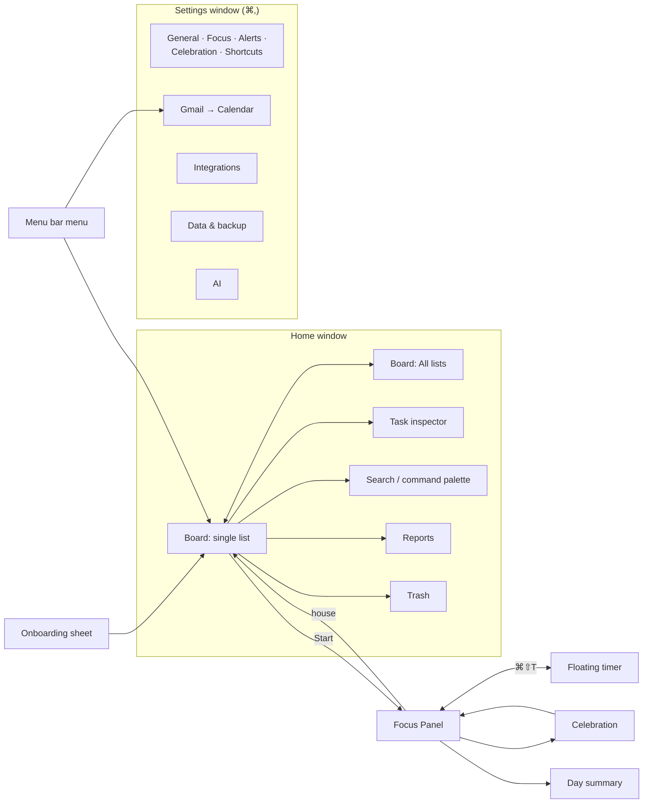

# Komodo: Design System

> The complete UI spec for Komodo, a native SwiftUI app for macOS 14+ on Apple silicon: foundations, components, and every screen with its states. Visual direction: **Obsidian Spectrum**. Every screen and state here is drawn on the canvas "Komodo — Design System & Screens" (PNG previews in `design/previews/`).
> Features: [FEATURES.md](./FEATURES.md) · Implementation: [ARCHITECTURE.md](./ARCHITECTURE.md). Sizes are in points (pt), and every shortcut uses ⌘.

**Contents**
- **Part A, Foundations:** 1 Principles · 2 Color · 3 Typography · 4 Layout · 5 Motion & sound · 6 Icons · 7 Voice · 8 Accessibility
- **Part B, Components:** 9 Inventory · 10 Specs
- **Part C, Screens:** 11 Navigation map · 12 App shell · 13 Screens · 14 System surfaces · 15 Screen checklist
- **Part D:** 16 Tokens in Swift

---

# Part A: Foundations

## 1. Principles

The visual direction is **Obsidian Spectrum**. The canvas "Komodo — Design System & Screens" is the visual source of truth; this document is the written one. Where they disagree on a pixel, the canvas wins; where they disagree on behavior, FEATURES.md wins.

1. **Native first.** Standard macOS windows, menus, controls, and keyboard behavior, styled with Komodo's colors.
2. **Black is the canvas.** The window is true black (`#000`). Surfaces step up in 3–5% white. Pixels off means calm.
3. **Time has temperature.** Backlog is cold (violet), This week is warm (blue), Today is hot (teal → lime) and sits on its own raised, glowing stage. Each column has an unmistakable identity.
4. **Color is earned.** Rainbow lives only in list badges, hover light, the live task and the finish line. Never decoration.
5. **Light follows the cursor.** Every card, tile, sheet group, menu and notification lights up where the pointer is (fill glow + border light, §5.1). This is Komodo's signature and is not optional.
6. **Numbers are heroes.** Timers are huge, bold, monospaced-digit, roll like an odometer, and glow while running. The live timer is a full **focus dial** (§10.2).
7. **Delight at the finish line, silence during the work.** Celebrations, sounds, and GIFs play on **Done**, never mid-task.
8. **Private, visibly.** Features that keep data on the Mac carry a green `lock.shield` "On this Mac" chip. Claude mode says so in amber wherever it's switched on.

## 2. Color

Each color is a color set in `Assets.xcassets` with a Dark value and an Increase Contrast value (Light is P2). Dark values below. Glyphs on any accent fill use `Palette.onAccent` (a 90% black), never white.

### 2.1 Neutrals and text

| Token | Hex | Use |
| --- | --- | --- |
| `Palette.bg` | `#000000` | Window canvas |
| `Palette.panel` | `#0A0A0C` | Columns, sections, Settings groups, Focus Panel base |
| `Palette.card` | `#131316` (top of gradient `#161619`) | Task cards, tiles |
| `Palette.cardHover` | `#17171B` | Hovered card, hovered rows |
| `Palette.raised` | `#1C1C1F` | Popovers, menus, dragged card |
| `Palette.border` | white 7% | 1 pt dividers, card edge |
| `Palette.borderStrong` | white 14% | Field outlines, hovered edges |
| `Palette.textPrimary` | `#FFFFFF` | Titles, timer digits (18.5:1 on card) |
| `Palette.textBody` | `#E5E5EA` | Card titles in Backlog, body (14.8:1) |
| `Palette.textTertiary` | `#C7C7CC` | Chips, secondary values (11.0:1) |
| `Palette.textSecondary` | `#A1A1A6` | Descriptions, captions (7.2:1) |
| `Palette.textMuted` | `#8E8E93` | Meta, placeholders — the minimum for readable text (5.7:1) |
| `Palette.textDisabled` | `#5A5A5F` | Disabled glyphs and decoration only |

### 2.2 Spectrum accents

| Token | Hex | Use |
| --- | --- | --- |
| `Palette.lime` | `#B5F23D` | Primary buttons (Start, Done), selected, Today identity |
| `Palette.teal` | `#2DD9C4` | App `AccentColor`: focus rings, drop targets, links |
| `Palette.liveGradient` | teal → lime (leading → trailing, or 120°) | Live beam, progress fills, primary button fill |
| `Palette.blue` | `#4D8DFF` | This week, scheduled tasks, calendar-sourced tasks |
| `Palette.violet` | `#8B7CFF` | Backlog identity, task-hours report series |
| `Palette.pink` | `#FF6AD5` | Pomodoro, "New" badges |
| `Palette.amber` | `#FFB547` | **Review**, "late", streak flame, timed alerts, Claude-mode warnings |
| `Palette.green` | `#35D483` | Toggles on, **Added**, **Active**, break, success |
| `Palette.cyan` | `#38C8FF` | Info, update available |
| `Palette.danger` | `#FF3D5A` | Fills and icons: Time's Up, destructive buttons |
| `Palette.dangerText` | `#FF6B85` | Danger text on cards (AA) |
| `Palette.onAccent` | `#06110A` | Glyphs on lime / teal / green / danger fills |

Tinted text for chips uses a lighter step of each accent: lime `#C9F76A`, teal `#5CE6D4`, blue `#8FBAFF`, violet `#B0A6FF`, pink `#FF9BE4`, amber `#FFC978`, green `#5FE3A1`, red `#FF8A9E`.

### 2.3 Status colors

| Meaning | Dot / icon | Chip | Used for |
| --- | --- | --- | --- |
| Success | `green` | tinted text on the color at 12% + 1 pt border at 28% | **Added**, **Active**, backup OK |
| Review | `amber` | same tint style | **Review**, "late", timed alerts |
| Error | `danger` | same tint style, `dangerText` text | **Error**, **Needs attention**, failed backup |
| Info | `blue` / `cyan` | same tint style | Update available, scheduled |
| Neutral | `textMuted` | 1 pt white-20% outline, no fill | **No event**, **Skipped**, **Paused**, **Offline** |
| Working | `teal`, pinging | none | Scanning, exporting |

### 2.4 List colors

The list badge palette: **W** lime `#B5F23D` · **P** teal `#2DD9C4` · **S** blue `#4D8DFF` · **L** pink `#FF6AD5` · **G** amber `#FFB547` · violet `#8B7CFF` · green `#35D483` · red `#FF6B85`. The badge glyph is a 90% black of the same hue (e.g. `#06110A` on lime, `#030A1A` on blue).

### 2.5 Column identities (time temperature)

| Column | Top bar | Ambient | Hover light | Icon | Width |
| --- | --- | --- | --- | --- | --- |
| Backlog | violet 3 pt | violet 18% radial from the top | violet | `moon` | 1fr |
| This week | blue → cyan 3 pt | blue 20% | blue | `calendar` + 7-day load strip, today ringed lime | 1.06fr |
| Today | 1.5 pt gradient border around the whole column | teal/lime aurora drifting (9 s) + outer lime glow | lime | `sun.max` | 1.52fr, on a raised stage |

### 2.6 Calendars and report series

- **Calendar swatches:** Komodo · From Gmail uses `lime`, Komodo · Review uses `amber`.
- **Report series:** task hours `violet`, breaks `green`, total session `amber`. Punctuality: early `green`, on time `blue`, late `amber`.

## 3. Typography

The UI font is **SF Pro** (`Font.system`). Keyboard caps and code use SF Mono (the canvas previews use Geist Mono as a stand-in). Every timer adds `.monospacedDigit()`.

| Token | Size (pt) | Weight | Use |
| --- | --- | --- | --- |
| `Typography.timerHero` | 50 | Bold, mono digits, tracking −1.5 | Live focus dial, Focus Panel dial |
| `Typography.timerLarge` | 58 | Bold, mono digits | Break countdown |
| `Typography.timerPill` | 15 | Bold, mono digits | Floating timer, menu bar menu |
| `Typography.display` | 30 | Heavy (800), tracking −0.9 | Screen titles, "You won the day.", stat values |
| `Typography.title` | 19 | Bold | Live task title, sheet titles |
| `Typography.heading` | 16 | Bold | Column names, section titles (Today column 18) |
| `Typography.cardTitle` | 15 | Semibold | Task card titles |
| `Typography.body` | 13.5 | Regular / Medium | Rows, descriptions, notes |
| `Typography.small` | 11.5 | Semibold | Chips, EST, time taken, meta |
| `Typography.label` | 11 | Bold, uppercase, tracking 0.08 em | Section labels, "UP NEXT", "2/7 DONE" |
| `Typography.kbd` | 10.5 | Medium, monospaced | Key caps |

**Formats**
- Durations: `2hr 30min`, `1hr`, `30min`.
- Timers: `H:MM:SS` past an hour, `MM:SS` below it, `+MM:SS` for overtime.
- Dates: relative when close ("Today 3:00 PM", "Thu 11 AM"), otherwise "Oct 2", via `Date.FormatStyle`.

## 4. Layout

### 4.1 Windows and regions

| Region | Size |
| --- | --- |
| Home window | 1200×800 default, min 900×600 |
| Sidebar | 248 pt ideal (200–300). Collapses with the standard sidebar button (⌃⌘S) |
| Board | 3 columns weighted 1 : 1.06 : 1.52 (Backlog, This week, Today), min 260 pt each, 18 pt gutters. Today sits on a raised stage |
| Task inspector | 380 pt ideal (320–460), on the trailing edge |
| Settings window | 760×560, sidebar plus a grouped form |
| Reports content | max 1080 pt wide |
| Focus Panel | 340 pt × the screen's visible height |
| Floating timer | 40 pt tall, 220–460 pt wide |
| Sheets | 400 pt (confirm), 480 pt (form), 560 pt (command palette) |

### 4.2 Spacing, radius, shadow

- **Spacing** (`Space`): s1 4 · s2 8 · s3 12 (card gap) · s4 16 (card and panel padding) · s5 20 · s6 24 (section gap) · s8 32 · screen margin 24–48. Column gutter 18.
- **Radius** (`Radius`): chip 8 · control 10 (buttons, fields) · card 18 · hero 22 (live card, sheet 20) · column 26 (Today stage 28). Pills use `Capsule()`.
- **Elevation**: separation comes from surface steps and hairlines. Cards carry a 1 pt inner top highlight (white 4.5%). Shadows:
  - `.shadowLift()`: black 95%, radius 22, y 12, plus a tinted glow in the card's spotlight color at 75%, radius 24, y 9 — hovered cards.
  - `.shadowFloat()`: black 90%, radius 30, y 12, plus a 1 pt white 10% stroke — popovers, menus, the floating timer, sheets.
  - `.shadowDrag()`: black 100%, radius 25, y 15, plus lime glow 45%, radius 22 — the dragged card (with −2.5° tilt, scale 1.03).
- **Glows**: `glowLive` lime 75% radius 22 · `glowBreak` green 75% · `glowDanger` danger 80%.

### 4.3 macOS conventions

| Area | Rule |
| --- | --- |
| Title bar | Unified toolbar (`.windowToolbarStyle(.unified(showsTitle: false))`). The traffic lights sit over the sidebar, and the toolbar area drags the window |
| Window keys | ⌘W closes the window (Komodo keeps running in the menu bar) · ⌘Q quits · ⌘H hides · ⌘M minimizes · ⌘, opens Settings · Esc closes popovers, the inspector, and sheets |
| Menus | The app menu (`.commands`), right-click menus (`.contextMenu`), and the Dock menu are native |
| Settings | The native Settings window, with sidebar navigation |
| Task detail | The native `.inspector` on the trailing edge |
| Tables and charts | SwiftUI `Table` and Swift Charts |
| Files | `.fileExporter` / `.fileImporter` (standard Save and Open panels) for backups and the backup folder |
| Scrollbars | Native overlay scrollbars |
| Surfaces | Solid colors: sidebar, inspector, and lists use `Palette` backgrounds with `.scrollContentBackground(.hidden)`, and no vibrancy |
| Full screen | The Home window supports full screen. The Focus Panel and floating timer float over full-screen apps and appear on every Space |
| Notifications | Reminder buttons (Start now, Snooze) show when the notification style is **Alerts**, so onboarding recommends it |
| Dock | Shown by default. Right-clicking the Dock icon offers Start · Pause · New task. Settings can hide the Dock icon (menu-bar-only mode) |

## 5. Motion and sound

| Token | Value |
| --- | --- |
| `Motion.fast` | `.easeOut(duration: 0.14)`: hover, color, spotlight fade |
| `Motion.base` | `.timingCurve(0.2, 0.8, 0.2, 1, duration: 0.22)`: menus, toggles, reflow |
| `Motion.slow` | `.timingCurve(0.2, 0.8, 0.2, 1, duration: 0.46)`: digits, panel ↔ floating timer |
| `Motion.spring` | `.spring(response: 0.4, dampingFraction: 0.62)`: press, lift, check pop, odometer digits |
| `Motion.enter` | 0.62 s ease-out, 60 ms stagger: new cards rise 12 pt from a 6 pt blur |

| Moment | Animation |
| --- | --- |
| Hover a card | Spotlight fades in (0.32 s), card lifts 3 pt on `Motion.spring`, action row slides in from +8 pt |
| Press any button | Scale 0.95 on `Motion.spring` |
| Primary button | A diagonal sheen sweeps across every 3.6 s |
| Live task | Border beam rotates (4.5 s linear), outer glow breathes (3.2 s), focus dial ticks every second (§10.2) |
| Swap live task (Skip / bolt) | Live card fades up and blurs out (0.26 s), next one lifts in from 22 pt below with blur, on a spring |
| Check off | Checkbox pops (1 → 1.15 → 1), title strikes through, card slides into Done |
| Find timer (⌘⇧P) | 3 teal ripples from the pill, 0.9 s |
| Timed alert | 1 amber ring pulse |
| Time's Up | Dial, beam and halo go red; digits shake twice (±4 pt, 0.3 s), then count `+MM:SS` |
| Break | Green dial; a breathing circle scales 1 → 1.12 over 4 s in / 4 s out with "Breathe in / Breathe out" |
| Drag | Card lifts: scale 1.03, −2.5° tilt, `.shadowDrag()`; a ghost slot stays behind; target column gets a teal dashed outline and a 2 pt teal insertion line |
| Celebration | Confetti burst (1.3 s), check circle pops and the check draws itself, copy fades up; dismisses after 2.5 s |
| Scanning | Status dot pings teal on a 1.6 s loop |

### 5.1 Signature effects (build these first, reuse everywhere)

| Effect | Spec | SwiftUI recipe (DesignSystem/Effects/) |
| --- | --- | --- |
| **Cursor spotlight** | Fill: radial 300 pt at the pointer, tint at 14%, under content. Border light: 1 pt ring, radial 220 pt at the pointer, 95% → 22% → 0. Fades in/out 0.32 s. Tint per meaning (lime Today, blue This week/scheduled, violet Backlog, green success, amber review, red danger, teal info) | `SpotlightModifier(tint:)`: `onContinuousHover` stores the point; overlay a `RadialGradient` fill clipped to the shape, plus `shape.strokeBorder(RadialGradient(...), lineWidth: 1)`; animate opacity with `Motion.fast`. `.spotlight(.lime)` on every card, tile, sheet group, menu, notification |
| **Border beam** | 1.5 pt conic border: dark → teal → lime → dark, rotating 360° in 4.5 s; shadow breathes 3.2 s. Grey + still when paused, red when Time's Up, green on break | `BeamBorder(state:)`: `AngularGradient` in a `strokeBorder`, rotated by a `TimelineView(.animation)` angle; breathing glow via `.shadow` driven by `phaseAnimator` |
| **Focus dial** | See §10.2 | `FocusDial` view: 60 tick `Capsule`s in a `ZStack` with `rotationEffect`; progress `Circle().trim` with `AngularGradient`; comet `Circle` positioned with trig; blurred rotating `AngularGradient` halo |
| **Odometer digits** | Each digit is a 0–9 vertical strip clipped to 1 line, offset by −digit × line height on `Motion.spring` | `OdometerText(value:)` or `.contentTransition(.numericText(countsDown: true))` with `.monospacedDigit()` |
| **Blur-rise enter** | opacity 0 → 1, y +12 → 0, blur 6 → 0, 0.62 s, 60 ms stagger | `.transition(.modifier(active: RiseModifier(1), identity: RiseModifier(0)))` |
| **Aurora** | Two soft radial blobs (teal 22%, lime 16%) blurred 10 pt, drifting ±6% and scaling 1 → 1.08 over 9 s | `TimelineView` + `offset`/`scaleEffect` on blurred `RadialGradient`s, Today stage only |

**Reduce Motion** (`@Environment(\.accessibilityReduceMotion)`): no beam rotation, halo, shake, pulse, ripple, confetti, scale or blur; digits change without rolling; the spotlight still appears (it's a color change) but without the lift. GIFs show a still frame.

**Sounds** are short `.caf` files (≤ 1.5 s) played with `NSSound`. Each has its own toggle, and all use the Settings volume.

| File | When |
| --- | --- |
| `success.caf` | Done |
| `tick.caf` | Timed alert |
| `break-start.caf` / `break-end.caf` | Break boundaries |
| `times-up.caf` | EST reaches zero |
| `chime.caf` | Reminders |

Gmail → Calendar is silent.

## 6. Icons

**SF Symbols** at medium weight, 13 pt in dense rows and 15 pt in toolbars. The default color is `Palette.textMuted`, and hover or active is `Palette.textPrimary`.

| Area | Symbols |
| --- | --- |
| Tasks | `plus` · `trash` · `chevron.up` / `chevron.down` · `line.3.horizontal` (drag) · `calendar.badge.clock` (schedule) · `repeat` · `checklist` (subtasks) · `note.text` (notes) · `ellipsis` · `archivebox` |
| Focus | `bolt.fill` (make live) · `play.fill` · `pause.fill` · `forward.end.fill` (skip) · `cup.and.saucer` (break) · `checkmark` · `timer` · `pip.enter` (to floating timer) · `pip.exit` (to panel) |
| Navigation | `house` · `square.grid.2x2` (All lists) · `chart.bar.xaxis` (Reports) · `gearshape` · `magnifyingglass` · `trash` (Trash) |
| Gmail and data | `envelope` · `calendar.badge.plus` · `calendar.badge.checkmark` · `tray` (Review) · `arrow.clockwise` (Scan now) · `pause.circle` · `lock.shield` (on this Mac) · `key` (API key) · `square.and.arrow.up` (export) · `square.and.arrow.down` (restore) · `folder` · `arrow.up.right.square` (open outside) · `puzzlepiece.extension` (integrations) · `sparkles` (assistant) · `mic` |

Provider logos (Google, Microsoft, Notion, and so on) follow each brand's guidelines, shown at 20 pt on a neutral tile.

### 6.1 App icon and menu bar icon

| Asset | Spec |
| --- | --- |
| App icon | `Komodo/Resources/AppIcon.icon`, an **Icon Composer** file: a near-black fill (`#141416` → `#030303`) with two glass layers, a stopwatch ring in the column spectrum (violet → blue → teal → lime, gap under the crown, colored shadow) and a gray crown with a white check. macOS 26+ derives the light, dark, clear and tinted appearances from it, and Xcode flattens it into `AppIcon.icns` for macOS 14–15, so there's no separate `AppIcon` set. The layer PNGs come from `scripts/render-icons.swift` |
| Menu bar icon | Image sets `MenuBarIcon`, `MenuBarIconRunning` and `MenuBarIconAttention`, rendered as **template images** (black plus alpha), 18×18 pt at @1x and @2x, so macOS tints them for light and dark menu bars. Same script |
| Menu bar states | **Idle:** the mark (ring, crown with stem, check). **Running:** the ring and crown with a filled wedge, plus the time as text. **Attention** (Google needs reconnecting): the idle mark with a dot cut into its top-right. Template images can't be colored, so the difference is the shape |
| In-app mark | `KomodoMarkShape` draws the same ring, crown and check on the same 24-unit grid |

## 7. Voice and microcopy

Short, playful, second person, and never guilt-tripping. Emoji at most once, in celebration lines.

| Moment | Copy |
| --- | --- |
| Start button | **Start** |
| Time's Up | **Time's up.** +5 min · +15 min · Done · Next |
| Done | "Nailed it. 12min early." / "Done. Right on time." / "Done. 8min over, still counts." |
| End of queue | **You won the day.** 7 tasks · 5hr 40min focused |
| Empty Today | "Nothing planned. Pull something in from This week, or add a task." |
| Offline | "You're offline. Everything still works, and Gmail will catch up when you're back." |
| Gmail promise | "Komodo reads your email to find meetings and deadlines. It never sends, deletes, or changes email." |
| On this Mac | "Email never leaves this Mac." |
| Claude mode | "Claude mode sends each email's text to Anthropic, using your API key." |
| Gmail added | "Added to your calendar: Design review, Thu 3:00 PM" |
| Gmail reconnect | "Google disconnected. Reconnect to keep adding events." |
| Backup done | "Backup saved: komodo-backup-2026-09-26.zip" |
| Restore confirm | "Your current data is backed up first, then replaced." |
| Delete all | "This deletes every list, task, and session on this Mac. Type DELETE to confirm." |

## 8. Accessibility

- [ ] All text meets 4.5:1 (§2.6), and non-text UI meets 3:1.
- [ ] Everything works from the keyboard. Focus uses the system focus ring in the teal accent color.
- [ ] Hit targets are at least 28×28 pt.
- [ ] Drag and drop has a keyboard path (⌥↑ / ⌥↓, and **Move to…**).
- [ ] VoiceOver: every control has a label. Timers use `.updatesFrequently`, so they aren't read every second. Time's Up, Done, and Gmail results are announced once with `AccessibilityNotification.Announcement`.
- [ ] State never relies on color alone: overdue has a clock icon, outcome chips have text, and status dots have labels.
- [ ] Reduce Motion is honored (§5).
- [ ] Increase Contrast uses the asset catalog's high-contrast variants (§2.7).

---

# Part B: Components

## 9. Inventory

| Component | Built on | Variants | States |
| --- | --- | --- | --- |
| Button | `Button` + `KomodoButtonStyle` | primary (lime), secondary (raised), ghost, danger · small 24 / regular 28 / large 36 | default, hover, pressed, focused, disabled, busy (spinner replaces icon) |
| Icon button | `Button` + plain style + hover background | 24 pt hit / 13 pt symbol; toolbar 28 / 15 | default, hover, toggled, disabled |
| Toggle | `Toggle` `.switch`, tinted success | none | off, on, disabled |
| Checkbox | `Toggle` `.checkbox` | none | off, on, disabled |
| Segmented | `Picker` `.segmented` | 2–4 segments | selected, disabled |
| Picker | `Picker` `.menu` | plain, with list badge, with swatch | closed, open, disabled |
| Text field | `TextField` + field style | default, search, monospaced | default, focused, error + message, disabled |
| Secure field | `SecureField` + Show button | none | masked, shown, testing, valid, invalid |
| Duration field | `TextField` with an `HH:MM` format | none | default, invalid |
| Date and time | `DatePicker` `.graphical` and `.hourAndMinute` | none | today, selected |
| Token field | `NSTokenField` (wrapped) | emails, domains | tokens, invalid token in danger |
| Chip | Custom capsule | filter, EST preset, outcome | default, hover, selected |
| Badge | Custom | list badge, source badge (Gmail, Calendar), count, `lock.shield` | none |
| Status dot | Custom circle + label | active, working (pulse), paused, attention, offline | none |
| Task card / live task card | Custom | see §10.1–10.2 | none |
| Section header | `DisclosureGroup`, styled | with count, total, add button | collapsed, expanded |
| Progress bar / dial | `ProgressView` style / `Circle().trim` | bar 6 pt · dial 14 pt | 0–100% |
| Control bar | `HStack` of buttons | panel, floating | per timer state |
| Floating timer | `NSPanel` + SwiftUI | none | see §10.5 |
| Inspector | `.inspector` | none | open, closed |
| Popover / menu | `.popover`, `Menu`, `.contextMenu` | none | native |
| Alert / sheet | `.alert`, `.confirmationDialog`, `.sheet` | confirm, form, typed confirm | default, busy, error |
| Toast | Custom overlay at the window bottom | info, undo, error | in, visible, out |
| Banner | Custom, above the content | info, warning, danger | dismissible or persistent |
| Tooltip | `.help()` | none | native |
| Key cap | Custom capsule | none | none |
| Empty state | `ContentUnavailableView` | none | none |
| Table | `Table` | none | rows, hover actions, selected, loading, empty |
| Tabs | `Picker` `.segmented` in the screen header | none | selected |
| Settings row | `Form` `.grouped` row | label + description + control | default, disabled, error |
| Stat tile / insight card | Custom | none | loading placeholder (`.redacted`) |
| Charts | Swift Charts | grouped bar, donut (`SectorMark`), line | hover annotation, empty |
| Command palette | `.sheet` with `TextField` + `List` | none | results, empty, command mode (`>`) |
| Page dots | Custom | none | current, done, upcoming |
| Integration card | Custom | none | not connected, connected, needs attention, coming soon |
| Suggestion card | Custom | none | default, adding, added, dismissed |
| Code block | `Text` in SF Mono + Copy button | none | copied (2 s checkmark) |
| Folder picker | Path text + Change button (`.fileImporter`) | none | default, missing folder |
| Celebration / day summary card | Custom + `NSImageView` for GIFs | panel, floating | none |
| Assistant bubble / chat / proposal | Custom | none | idle, listening, thinking, proposal, applied |

## 10. Component specs

### 10.1 Task card

```
┌────────────────────────────────────────┐
│ [W]  Wireframes: floating timer   ◔1/3 │  list badge 22 · cardTitle · subtask dial 30
│ [Sun 10:00 AM] [2hr]                   │  chips (Typography.small, 24 tall)
│ ─ ─ ─ ─ ─ ─ ─ ─ ─ ─ ─ ─ ─ ─ ─ ─ ─ ─ ─ │  dashed hairline
│ ▓▓▓░░░░░░░░░░░░░░░░░░░░░░░░    18:00   │  4 pt progress (glowing fill) · time taken
└────────────────────────────────────────┘
```

- `Palette.card` gradient, `Radius.card` (18), padding 16, 12 between rows, 12 between cards, inner top highlight.
- **Spotlight** tinted by column (§5.1), always on.
- **Hover**: lift 3 pt + `.shadowLift()`, and an action row slides in top-right over a fade (schedule · move → · ⋯ in Backlog; done · move to Today · ⋯ in This week; done · **bolt** in Today).
- **Chips**: EST (`clock`), subtasks (`checklist` x/y), notes, links, schedule (blue), due (amber), repeat (violet), overdue (red with clock), source (Gmail / Calendar) top-right.
- **Today queue cards** add an index tile (30 pt) with a drag grip under it, and a lime "starts ~2:23 PM" projection chip computed from the queue.
- **Done**: green check disc, strikethrough in muted text, result chip ("12min early" green / "8min over" amber).
- **Dragging**: `.shadowDrag()`, tilt −2.5°, scale 1.03, ghost slot left behind, 2 pt teal insertion line with dot ends.
- **Focused**: 2 pt teal ring with a 2 pt black gap.

### 10.2 Live task card and the focus dial

```
╭──────────────────────────────────────────────╮  1.5 pt border beam (§5.1), radius 24
│ (● LIVE) (Flow 25min) (✉ Re: Design…) [W] │  status pill · flow chip · source · badge
│ Design review prep with Apurva               │  Typography.title
│ ┌──────────────────────────────────────────┐ │
│ │  ⟲ dial 120      09:25                   │ │  focus dial · timerHero with glow
│ │   84% of est     left of 1hr · 50:35 el. │ │
│ │                  ▬▬▭▭ Sprint 2 of 4      │ │
│ └──────────────────────────────────────────┘ │
│ ↗ 2 links opened · Subtasks 2/3      ⌘⌥F done│
│ [Break] [Notes] [Pause] [Skip] [ Done ]      │  control bar (§10.4)
╰──────────────────────────────────────────────╯
```

**Focus dial** (120 pt in the Board, 204–236 pt in the Focus Panel):
- **Tick ring**: 60 ticks (majors every 5 are longer). A radar sweep: the current second's tick is white with a glow, the 14 before it fade from the state color to transparent, the rest sit at white 9% (majors 20%). Updates every second from `TimelineView(.periodic(from:by: 1))`.
- **Progress arc**: 7 pt `Circle().trim(0, elapsed/EST)` with a teal → lime gradient, round caps, animating on `Motion.slow`.
- **Comet head**: a 13 pt white dot at the arc's end with a glow in the state color.
- **Halo**: a blurred conic gradient behind the dial, rotating in 7 s, breathing opacity. Off when paused.
- **Center**: percent of EST (20 pt heavy) + "OF EST" label (Board), or the digits themselves (Focus Panel).
- **Digits**: odometer, `timerHero`, lime text glow while running; the colon beats at 1 Hz.
- **Flow chip**: minutes since the last resume ("Flow 25min"), amber flame. Resets on Pause / Break.

| State | What changes |
| --- | --- |
| Running | Teal/lime beam + breathing glow, lime ticks, white glowing digits |
| Paused | Beam grey and still, ticks grey and frozen, digits muted, colon blinks, **Resume** becomes primary, Done secondary |
| Time's Up | Beam, arc, halo and ticks red; digits `+MM:SS` in `dangerText`, shake on entry; controls become `[+5 min] [+15 min] [Done] [Next]` |
| Pomodoro sprint | Pink "SPRINT 2 OF 4" pill, four sprint dots fill lime |
| Break | Card replaced by the green break card: 58 pt green countdown, breathing circle, "Up next", `[Skip break] [+2 min]` |

### 10.3 Day meter

A tile above the Today column: `2/7 DONE` (28 pt heavy + lime label), EST LEFT · FOCUSED · ENDS AROUND (projected finish time, lime) on the right, then one 7 pt segment per task: done segments are the live gradient with glow, the current one pulses at 50% lime, the rest are white 10%.

### 10.4 Control bar

`Break · Notes · Pause · Skip · Done` as five equal 56 pt tiles (symbol over label, `Typography.small`), `Radius` 14, white 4.5% fill. **Done** is the only primary: live-gradient fill with the sheen. Hover lifts 2 pt; press scales 0.92. Each `.help()` shows the shortcut ("Done ⌘⌥F").

### 10.5 Floating timer

```
╭──────────────────────────────────╮
│ ◔ Design review prep   09:27     │   default · 40 pt, radius 14, glass
╰▔▔▔▔▔▔▔▔▔▔▔▔▔▔▔▔▔▔▔▔──────────────╯   progress line along the bottom edge
╭─────────────────────────────────────────────────────╮
│ ◔ Design review prep   09:27  │ ‖  ✓  »  ◷  ✎  ⤢    │  hover: controls expand on a spring
╰─────────────────────────────────────────────────────╯
```

- Glass: `.ultraThinMaterial` over `Color(white: 0.1, opacity: 0.84)`, 1 pt white 10% stroke, `.shadowFloat()`, 40 pt tall, 12–14 pt horizontal padding.
- Mini ring (18 pt) = elapsed ÷ EST; digits `timerPill` with lime glow; soft breathing lime glow while running.
- Title capped at 200 pt, marquee when **Scrolling title** is on (paused on hover).

| State | Look |
| --- | --- |
| Running | White glowing digits, lime ring |
| Paused | Pause glyph, muted digits, blinking colon, no glow |
| Time's Up | Danger outline + red glow, `+02:14` in `dangerText`, shake, inline `+5` and `Done` |
| Break | Green tint, cup symbol, green countdown, "then Review accounts" |
| Locator (⌘⇧P) | 3 teal ripples |
| Timed alert | 1 amber pulse, "Still on it?" |

### 10.6 Fields and editors

- **Text field:** 36 pt (28 pt in dense rows), white 4% fill, 1 pt white 8% border, `Radius.control`, 8 pt padding, muted placeholder, and the system focus ring. On error, a `Palette.danger` border and an 11 pt message below in `Palette.dangerText`.
- **Secure field:** masked (`••••••••sk-4f2a`) with **Show** and **Test**. The result is inline: a checkmark and "Key works" in success, or the error in danger.
- **Duration field:** 56 pt wide, `00:00`, monospaced digits, centered.
- **Notes editor:** a wrapped `NSTextView` (rich text, stored as RTF) with a toolbar: Bold · Italic · Underline · Strikethrough · Link · Bulleted list · Numbered list · **Clear** (capsule). Symbols are 13 pt muted.
- **Toggle:** the system switch tinted `Palette.green`. **Checkbox:** the system checkbox, which picks up the teal accent.

### 10.7 Button

| Variant | Background | Text | Hover |
| --- | --- | --- | --- |
| Primary | `Palette.lime` | `Palette.onAccent` | `.brightness(0.06)` |
| Secondary | `Palette.raised` | `Palette.textPrimary` | `Palette.cardHover` |
| Ghost | clear | `Palette.textSecondary` | `Palette.cardHover` |
| Danger | `Palette.danger` | `Palette.onAccent` (5.4:1; white is only 3.5:1) | `.brightness(0.06)` |

Sizes are small 24, regular 28, and large 36 pt tall, with 10, 12, and 16 pt horizontal padding. Leading symbols are 13 pt with a 6 pt gap. Use one primary button per view.

### 10.8 Table

SwiftUI `Table` with `.tableStyle(.inset)`, 32 pt rows, `Typography.body`, and a column header in `Typography.label`. Row actions appear on hover as trailing icon buttons and are also in the row's context menu. The empty state is a `ContentUnavailableView` in the table area.

### 10.9 Banner, toast, empty state

- **Banner:** full width above the content, 36 pt, tinted background (§2.3), with a symbol, message, action button, and optional close button.
- **Toast:** bottom center, `Palette.raised`, `Radius.control`, `.shadowFloat()`. A message plus a lime action (e.g. **Undo**), shown for 5 s, at most 3 stacked.
- **Empty state:** `ContentUnavailableView` with a symbol, a title, one line of description, and one button.

### 10.10 Integration card

```
┌──────────────────────────────────────────┐
│ [G]  Gmail → Calendar          ● Active  │  logo 20 · name (Typography.body, semibold) · status dot
│      Adds meetings and deadlines from    │  description (Typography.small, muted, 2 lines)
│      email to Google Calendar.           │
│      apurva@gmail.com          [Manage]  │  account (small) · button
└──────────────────────────────────────────┘
```

- **Not connected:** a secondary **Connect** button and no status.
- **Needs attention:** a danger dot, "Reconnect", and a danger-outline button.
- **Coming soon:** 60% opacity with a "Coming soon" chip and no button.

### 10.11 Suggestion card (Gmail Review, P1)

```
┌──────────────────────────────────────────────────────────┐
│ Design review with Apurva                  Thu 3:00 PM   │
│ From Apurva · "Re: Design review" · Sep 24               │
│ "Can we do Thursday at 3pm? Room 4B or Meet."            │  evidence in italic, muted
│ [Add to calendar]  [Edit]  [Dismiss]        Open email ↗ │
└──────────────────────────────────────────────────────────┘
```

**Add to calendar** moves the event from Review to From Gmail. **Edit** opens the event's fields in a popover. **Dismiss** deletes it from Review. After any action the card collapses, with a 5 s Undo toast.

### 10.12 Command palette row

`[status] Title · [W] Work · Today · 45min`. The selected row gets a `Palette.cardHover` background and a 2 pt teal leading bar. Group headers use `Typography.label`.

---

# Part C: Screens

## 11. Navigation map



## 12. App shell (Home window)

```
┌──────────────────────┬─────────────────────────────────────────────────────────────────────────┐
│ Komodo               │ [banner slot: offline / reconnect Google / update ready]                │
│                      ├─────────────────────────────────────────────────────────────────────────┤
│ Home                 │                                                                         │
│ All lists            │                         page content                                    │
│ Reports              │                                                                         │
│                      │                                                                         │
│ LISTS              + │                                                                         │
│ [W] Work          12 │                                                                         │
│ [P] Personal       4 │                                                                         │
│ [S] Side project   7 │                                                                         │
│                      │                                                                         │
│ ──────────────────── │                                                                         │
│ Trash                │                                                                         │
│ Settings             │                                                                         │
│ ● Gmail · 1 min ago  │                                                                         │
└──────────────────────┴─────────────────────────────────────────────────────────────────────────┘
```

- **Window:** a `NavigationSplitView` with a unified toolbar. The traffic lights sit over the sidebar.
- **Sidebar:** a `List` with `.listStyle(.sidebar)` on `Palette.panel`. Rows are 28 pt with a 13 pt symbol and `Typography.body`, and the selected row gets `Palette.cardHover`. Lists show a badge, name, and open-task count (muted, trailing). They reorder by dragging, and the context menu has Rename · Color & Icon · Archive · Delete.
- **Sidebar footer:** the Gmail status (dot + "Gmail · 1 min ago") opens Settings → Gmail → Calendar. It's hidden when Gmail isn't connected.
- **Banner slot:** at most one banner, in priority order: danger (reconnect), then warning (offline), then info (update).

## 13. Screens

### 13.1 Onboarding (P0)

A sheet over the Home window at first launch (560×520), with **Skip** at the top right.

| Step | Content |
| --- | --- |
| 1 Plan | Illustration of 3 columns. "Plan your day in minutes." |
| 2 Focus | Illustration of the floating timer over a window. "One task at a time, always on screen." |
| 3 Win | Illustration of the celebration card. "Finish, celebrate, repeat." |
| 4 Notifications | "Allow notifications for reminders and breaks. Choose **Alerts** so the buttons show." [Allow] [Not now] |
| 5 Today | Multi-line task entry (below) |
| 6 Gmail (optional) | "Turn emails into calendar events?" with the privacy promise. [Connect Google] [Skip for now] |

```
┌────────────────────────────────────────────────────────┐
│                                                 Skip   │
│                                                        │
│   What do you want to finish today?                    │
│   One task per line. Add a time like "45m".            │
│   ┌──────────────────────────────────────────────────┐ │
│   │ Write launch email 45m                           │ │
│   │ Review the API PR 30m                            │ │
│   │ Gym 1h                                           │ │
│   └──────────────────────────────────────────────────┘ │
│   3 tasks · Est 2hr 15min                              │
│                                                        │
│   ● ● ● ● ○ ○                      [Back]  [Continue]  │
└────────────────────────────────────────────────────────┘
```

- With step 5 empty, the button reads **Skip** instead of **Continue**.
- Return adds a line and ⌘Return continues. Each line's parsed EST shows as a muted chip at its end.

### 13.2 Board, single list (P0)

```
┌──────────────────────┬─────────────────────────────────────────────────────────────────────────┐
│ Komodo               │ [W] Work ▾                  Search ⌘F                          [ Start ]│
│                      ├────────────────────────┬────────────────────────┬───────────────────────┤
│ Home                 │ BACKLOG              + │ THIS WEEK            + │ TODAY               + │
│ All lists            │                        │                        │ Est 6hr 30min         │
│ Reports              │ ┌────────────────────┐ │ ┌────────────────────┐ │ ▓▓▓▓░░░░░░  2/7 DONE  │
│                      │ │ Q4 roadmap     [W] │ │ │ Wireframes     [W] │ │ ┌───────────────────┐ │
│ LISTS              + │ │ 3hr          00:00 │ │ │ Thu 11AM     00:00 │ │ │ 1 Review     [W]  │ │
│ [W] Work          12 │ └────────────────────┘ │ └────────────────────┘ │ │ 2hr 30min  00:00  │ │
│ [P] Personal       4 │ ┌────────────────────┐ │ + ADD TASK             │ └───────────────────┘ │
│ [S] Side project   7 │ │ Hire designer  [W] │ │                        │ ┌───────────────────┐ │
│                      │ │ 1hr          00:00 │ │                        │ │ 2 Fix bug #42 [W] │ │
│ ──────────────────── │ └────────────────────┘ │                        │ │ 1hr 30min  30min  │ │
│ Trash                │ + ADD TASK             │                        │ └───────────────────┘ │
│ Settings             │                        │                        │ + ADD TASK            │
│ ● Gmail · 1 min ago  │                        │                        │ ▸ 1 Scheduled today   │
│                      │                        │                        │ ▸ 2 Done · 2hr 30min  │
└──────────────────────┴────────────────────────┴────────────────────────┴───────────────────────┘
```

- **Toolbar:** a list picker (badge + name + ▾, which also holds the list actions), a search field that opens the palette, and **Start** (primary). Start is disabled when nothing is eligible, with the tooltip "Add a task to Today".
- **Columns:** a `Typography.label` header with **+** to insert at the top, then the cards, then **+ ADD TASK**. Today adds the day progress, **Scheduled today**, and **Done** (collapsed).
- **States:**
  - An empty column shows a dashed `Palette.border` drop zone reading "Drop tasks here".
  - An empty Today shows a `ContentUnavailableView`: "Nothing planned. Pull something in from This week, or add a task."
  - While dragging, the target column gets a teal outline.
- **Keys:** clicking a card opens the inspector, and double-clicking the title renames it. Space toggles done, ⌥↑/⌥↓ moves the card, `N` adds a task to the focused column, and ⌘⌥T quick-adds to Today.

### 13.3 Board, All lists (P0)

The same as §13.2, but the toolbar shows **All lists** with a filter menu (tick lists to hide), and every card shows its list badge. New tasks go to the last-used list, which the quick-add row can change.

### 13.4 Quick add (P0)

```
┌──────────────────────────────────────────────────┐
│ Write launch email 45m                           │
│ [15m] [30m] [1h]     [W] Work ▾   Today ▾   ↵ Add│
└──────────────────────────────────────────────────┘
```

- It appears in place of **+ ADD TASK**, or as a small panel at the top of the window for ⌘⌥T.
- The parsed EST shows as a lime chip ("45min") at the trailing edge.
- Return adds the task and stays open, Esc closes, and ⌘Return adds it and starts it.

### 13.5 Task inspector (P0)

The native `.inspector` on the trailing edge of the Home window.

```
┌──────────────────────────────────────────┐
│ ☐  Design review prep            ⋯   ✕   │
│ ──────────────────────────────────────── │
│ List        [W] Work ▾                   │
│ Estimate    [01:00]      Taken  00:24    │
│ Schedule    Thu, Oct 1 · 2:30 PM   ✕     │
│ Repeat      Doesn't repeat ▾             │
│ ──────────────────────────────────────── │
│ SUBTASKS                          ◔ 1/3  │
│ ☑ Collect feedback                       │
│ ☐ Draft agenda                           │
│ ☐ Book room                              │
│ + Add subtask                            │
│ ──────────────────────────────────────── │
│ NOTES                                    │
│ ┌──────────────────────────────────────┐ │
│ │ Figma: https://figma.com/file/...    │ │
│ │ B I U S ↗ • 1.           Clear       │ │
│ └──────────────────────────────────────┘ │
│ [✓] Open links when this task starts     │
│ ──────────────────────────────────────── │
│ SOURCE   ✉ Gmail · Apurva                │
│          "Re: Design review" Open ↗      │
│ SESSIONS  3 · 1hr 12min total      View  │
│ ──────────────────────────────────────── │
│ Created Sep 20 · Edited 2 min ago        │
└──────────────────────────────────────────┘
```

- The ⋯ menu holds Duplicate · Move to List · Archive · Delete.
- **Source** appears only for tasks that came from Gmail, a calendar, or an integration.
- While the task is live, the title and estimate are read-only, with a lock symbol and the tooltip "Pause to edit".
- Esc closes the inspector, and ⌘↑/⌘↓ moves to the previous or next task.

### 13.6 Schedule popover (P0) and Repeat (P1)

```
┌────────────────────────────────┐    ┌────────────────────────────────┐
│ Today                 Sat 26   │    │ ← Thu, Oct 1                   │
│ Later today           4:15 PM  │    │ Time     [ 2:30 PM ]  + ADD    │
│ Tomorrow              Sun 27   │    │ Repeat   [ Weekly on Thu ▾ ]   │
│ Next week             Sat 3    │    │                                │
│ ─────────────────────────────  │    │ Reminder at start time  [✓]    │
│      September 2026      ‹ ›   │    │                                │
│  M  T  W  T  F  S  S           │    │                                │
│     1  2  3  4  5  6           │    │ [Remove schedule]      [Save]  │
│  ...                           │    └────────────────────────────────┘
│                       [Next]   │           Step 2: time & repeat
└────────────────────────────────┘
       Step 1: date
```

- The calendar is a graphical `DatePicker`, and the time field is an hour-and-minute `DatePicker`.
- The Repeat options are Doesn't repeat · Every day · Every weekday · Weekly on *day* · Monthly on the *n*th · Custom…
- **Custom** opens a small sheet: "Every [ 2 ] [ weeks ▾ ]", a weekday row (M T W T F S S as 24 pt circles), and "Ends: Never / On date".
- Editing an existing repeat shows **Replace existing tasks** with a one-line explanation.

### 13.7 Search and command palette (P0)

```
┌──────────────────────────────────────────────────────────┐
│ ⌕  design rev                                            │
│ ──────────────────────────────────────────────────────── │
│ WORK                                                     │
│ ▌☐ Design review prep       Today · 1hr                  │
│  ☐ Design review notes       This week                   │
│ PERSONAL                                                 │
│  ☑ Design course signup      Done · Sep 12               │
│ ──────────────────────────────────────────────────────── │
│ ↑↓ move · ↵ open · ⌘↵ start now · esc close              │
└──────────────────────────────────────────────────────────┘
```

- A 560 pt sheet near the top of the window.
- Typing `>` switches to commands: New Task · Start · Export Backup · Scan Gmail Now · Settings.
- With no match, it shows "No tasks match 'xyz'." and a **Create task "xyz"** action.

### 13.8 Focus Panel (P0)

A 340 pt panel on `Palette.panel`, docked to the chosen screen edge.

```
┌────────────────────────────────────────┐
│ [All ▾]  Today              ⚙   ⌂   ⇥  │
│ Est: 8hrs                              │
│ ▓▓▓▓▓▓░░░░░░░░░░░░░░░░░░    2/7 DONE   │
│ ╭────────────────────────────────────╮ │
│ │ Marketing brief           01:00:23 │ │
│ ╰────────────────────────────────────╯ │
│ [Break] [Notes] [Pause] [Skip] [Done]  │
│ ┌────────────────────────────────────┐ │
│ │ 1  Review accounts             [W] │ │
│ │ 2hr 30min                    00:00 │ │
│ └────────────────────────────────────┘ │
│ ┌────────────────────────────────────┐ │
│ │ 2  Fix bug #42                 [G] │ │
│ │ 1hr 30min                    30min │ │
│ └────────────────────────────────────┘ │
│ + ADD TASK                             │
│ 1 Scheduled tasks today              + │
│ ┌────────────────────────────────────┐ │
│ │ Wireframes            Mon 11AM [F] │ │
│ └────────────────────────────────────┘ │
│ 2 Done                       2hr 30min │
└────────────────────────────────────────┘
```

| State | What changes |
| --- | --- |
| Running | As above |
| Paused | The live border turns grey with "Paused". **Pause** becomes **Resume** (primary), and **Done** becomes secondary |
| Time's Up | A danger border and `+02:14`. The control bar becomes `[+5 min] [+15 min] [Done] [Next]` |
| Pomodoro sprint | "Sprint 2 of 4" with the sprint countdown; the dots fill as sprints complete |
| Break | The live card is replaced by the break card (below) |
| Only scheduled tasks left | "Next: Wireframes at 11:00 AM" with **Start early** |
| End of queue | The day summary (§13.11) replaces the list |

```
┌────────────────────────────────────────┐
│ ╭────────────────────────────────────╮ │
│ │ ◷ Break                            │ │
│ │              04:12                 │ │   Typography.timerLarge, success color
│ │ Up next: Review accounts           │ │
│ │ [Skip break]           [+2 min]    │ │
│ ╰────────────────────────────────────╯ │
└────────────────────────────────────────┘
```

- The header symbols are gearshape (**Quick Settings**: a popover with Pomodoros, sprint and break lengths, panel side, and sounds), house (exit Focus mode), and pip.enter (switch to the floating timer).
- Hovering a card shows a **bolt** button that makes it live, and every list action works here too.

### 13.9 Floating timer (P0)

The states are in §10.5. When a task completes in floating mode, the celebration appears as a 320×240 card anchored above the timer.

### 13.10 Celebration (P0)

```
┌────────────────────────────────────┐
│ ┌────────────────────────────────┐ │
│ │                                │ │
│ │            [ GIF ]             │ │  240×180, Radius.hero
│ │                                │ │
│ └────────────────────────────────┘ │
│   Nailed it. 12min early.          │  Typography.heading
│   Next up: Review accounts         │  muted
└────────────────────────────────────┘
```

- In the panel it fills the list area. In floating mode it's a card above the timer.
- It dismisses after 2.5 s, or sooner with a click or Esc. With the success screen off, only the sound plays.

### 13.11 Day summary (P0; streak and review P1)

```
┌────────────────────────────────────────┐
│ You won the day.                       │  Typography.title
│ ┌──────────┐ ┌──────────┐ ┌──────────┐ │
│ │ 7        │ │ 5h 40m   │ │ 82%      │ │  stat tiles
│ │ tasks    │ │ focused  │ │ on est.  │ │
│ └──────────┘ └──────────┘ └──────────┘ │
│ Early 4 · On time 1 · Late 2           │
│ 4-day streak                           │
│ ────────────────────────────────────── │
│ NOT FINISHED (2)                       │
│ Hire designer   [Tomorrow ▾]           │
│ Q4 roadmap      [This week ▾]          │
│ ────────────────────────────────────── │
│ [See reports]                  [Done]  │
└────────────────────────────────────────┘
```

### 13.12 Reports: Overview (P1)

```
┌──────────────────────────────────────────────────────────────────────────────────┐
│ Reports                            [All lists ▾]  [Today|7 days|30 days|Custom]  │
│ Overview   Punctuality   Time spent   Sessions                                   │
│ ────────                                                                         │
│ ┌──────────────┐ ┌──────────────┐ ┌──────────────┐ ┌──────────────┐              │
│ │ Work days    │ │ Tasks done   │ │ Hours        │ │ Avg / task   │              │
│ │ 5            │ │ 42           │ │ 31.5         │ │ 45min        │              │
│ └──────────────┘ └──────────────┘ └──────────────┘ └──────────────┘              │
│ Daily productivity           ■ Task hours  ■ Breaks  ■ Session                   │
│   ▆▆    ▇▇    ▅▅    ██    ▃▃    __    __                                         │
│   Mon   Tue   Wed   Thu   Fri   Sat   Sun                                        │
│ ┌──────────────────────┐ ┌──────────────────────┐ ┌──────────────────────┐       │
│ │ Most productive hour │ │ Most productive day  │ │ Most productive month│       │
│ │ 10–11 AM             │ │ Tuesday              │ │ September            │       │
│ └──────────────────────┘ └──────────────────────┘ └──────────────────────┘       │
└──────────────────────────────────────────────────────────────────────────────────┘
```

- **Chart:** grouped `BarMark`s per day in the three series colors, with a hover annotation ("Tue · 6hr 10min tasks · 40min breaks"). The y axis is in hours.
- **Empty:** "No sessions in this range yet. Start a task to see your stats."

### 13.13 Reports: Punctuality, Time spent, Sessions (P1)

- **Punctuality:** a 100% bar (Early / On time / Late in success, blue, and warning), a weekly accuracy `LineMark`, and a table (Task · List · Est · Actual · Δ) sorted by the largest overrun.
- **Time spent:** a donut (`SectorMark`) by list, beside a table (List · Hours · %). Clicking a list shows its tasks.
- **Sessions:**

```
┌──────────────────────────────────────────────────────────────────────────────────┐
│ Total 31hr 30min · 42 tasks · 96 sessions      [Lists ▾] [✓ Breaks]  [+ Add]     │
│                                                                    [Export ▾]    │
│ ──────────────────────────────────────────────────────────────────────────────── │
│ TASK               LIST       #   DATE     START    END      DURATION            │
│ Marketing brief    [W] Work   3   Sep 26   9:02 AM  10:02 AM 1hr            ⋯    │
│ Review accounts    [W] Work   1   Sep 26   10:05    10:35    30min          ⋯    │
│ Break              —          —   Sep 26   10:35    10:40    5min           ⋯    │
└──────────────────────────────────────────────────────────────────────────────────┘
```

- **Export** offers PDF and CSV.
- **Add or edit session** (480 pt sheet): Task (searchable picker), Type (Work / Break), Date, Start, End, and Duration (editing it moves End). Buttons: [Delete] [Cancel] [Save].

### 13.14 Trash (P1)

A table with Item · Type (List / Task) · From list · Deleted, and the row actions **Restore** and **Delete now**. The header says "Items are deleted after 30 days" beside **Empty Trash** (danger ghost). The empty state is "Trash is empty."

### 13.15 Settings window and General (P0)

```
┌──────────────────────┬─────────────────────────────────────────────────────────────────────────┐
│ Settings             │ General                                                                 │
│                      │                                                                         │
│ General              │ Open Komodo at login                                              [on]  │
│ Focus                │ Keeps Gmail → Calendar and reminders running.                           │
│ Alerts & sounds      │ ─────────────────────────────────────────────────────────────────────── │
│ Celebration          │ Show Komodo in the Dock                                           [on]  │
│ Shortcuts            │ ─────────────────────────────────────────────────────────────────────── │
│ Gmail → Calendar     │ Week starts on                                              [Monday ▾]  │
│ Integrations         │ ─────────────────────────────────────────────────────────────────────── │
│ Data & backup        │ Quick task presets                                  [15m] [30m] [1h] +  │
│ AI                   │ ─────────────────────────────────────────────────────────────────────── │
│ About                │ Hide EST and time taken on cards                                  [off] │
└──────────────────────┴─────────────────────────────────────────────────────────────────────────┘
```

- This is the native Settings window (⌘,): a sidebar list plus a `Form` with `.formStyle(.grouped)` on `Palette.panel`.
- Each row is a label (`Typography.body`) with an optional description (`Typography.small`, muted), and the control trailing. Changes apply instantly; there's no Save button.

### 13.16 Settings: Focus, Alerts & sounds, Celebration, Shortcuts (P0)

| Page | Rows (control) |
| --- | --- |
| Focus | Panel screen (picker) · Panel side (segmented: Left / Right) · Float above full-screen apps (toggle) · Pomodoros (toggle) · Work sprint · Break · Default break (duration fields) · Scrolling title (toggle) · Open links in notes when a task starts (toggle) |
| Alerts & sounds | Timed alerts during a task (toggle) + interval (picker) + sound (picker with ▶ preview) + pulse timer (toggle) · Reminder sound (picker) · Volume (slider) |
| Celebration | Success screen · GIF · Sound (toggles) · Preview button |
| Shortcuts | A table of Action · Shortcut (a `KeyboardShortcuts.Recorder`) · Scope · Reset. A conflict shows in danger text: "Used by another app" |

### 13.17 Settings: Integrations (P1; Gmail is P0)

```
┌───────────────────────────────────────────────────────────────────────────────────────┐
│ Integrations                                                                          │
│ Everything runs on this Mac. Tokens are stored in the macOS Keychain.                 │
│                                                                                       │
│ ┌──────────────────────────────────────────┐ ┌──────────────────────────────────────┐ │
│ │ [G] Gmail → Calendar           ● Active  │ │ [G] Google Calendar import           │ │
│ │     Meetings & deadlines from email.     │ │     Show calendar events as tasks.   │ │
│ │     apurva@gmail.com          [Manage]   │ │                         [Connect]    │ │
│ └──────────────────────────────────────────┘ └──────────────────────────────────────┘ │
│ ┌──────────────────────────────────────────┐ ┌──────────────────────────────────────┐ │
│ │ [M] Microsoft Calendar                   │ │ [N] Notion              Coming soon  │ │
│ │     Show Outlook events as tasks.        │ │     Sync a database.                 │ │
│ │                           [Connect]      │ │                                      │ │
│ └──────────────────────────────────────────┘ └──────────────────────────────────────┘ │
│  Todoist · Linear · ClickUp · Asana (Coming soon) · Local MCP server (P1)             │
└───────────────────────────────────────────────────────────────────────────────────────┘
```

Token-based providers open a sheet with "Paste your API token", a "Where to find it" link, and [Test] and [Save] buttons.

### 13.18 Gmail → Calendar: connect (P0)

**A. Not connected**

```
┌─────────────────────────────────────────────────────────────────────┐
│ Gmail → Calendar                                  (On this Mac)     │
│                                                                     │
│ Turn emails into calendar events                                    │  Typography.title
│ ✓ Reads Gmail. Never sends, deletes, or changes email.              │
│ ✓ Adds events to two new calendars: "Komodo · From Gmail"           │
│   and "Komodo · Review".                                            │
│ ✓ Email is read on this Mac and never stored.                       │
│                                                                     │
│ Google OAuth client ID                                              │
│ [ 1234-abc.apps.googleusercontent.com                          ]    │
│ Personal use: create your own client in Google Cloud.  How? ↗       │
│                                                                     │
│                                              [ Connect Google ]     │
└─────────────────────────────────────────────────────────────────────┘
```

**B. Signing in:** Google's sign-in sheet opens (`ASWebAuthenticationSession`). The page shows "Finish signing in with Google…" and [Cancel], and closing the sheet cancels.

**C. Connected, first scan**

```
┌─────────────────────────────────────────────────────────────────────┐
│ ✓ Connected as apurva@gmail.com                                     │
│                                                                     │
│ Scanning the last 3 days…                          34 / 120 emails  │
│ ▓▓▓▓▓▓▓▓░░░░░░░░░░░░░░░░░░░░░░░░                                    │
│                                                                     │
│ → then:  Added 4 events · 2 to review · 114 skipped                 │
│          [Open Google Calendar ↗]      [View activity]              │
└─────────────────────────────────────────────────────────────────────┘
```

**Errors**
- **Consent denied:** "Google access wasn't granted. Komodo needs both permissions to work." [Try again]
- **Invalid client ID:** an inline field error with the "How?" link.
- **A permission unticked:** "Calendar access is missing. Reconnect and keep both boxes ticked."

### 13.19 Gmail → Calendar: Overview, Settings, Activity (P0)

A segmented control switches between **Overview · Settings · Activity**, plus **Review** in P1.

```
┌──────────────────────────────────────────────────────────────────────────────────────┐
│ Gmail → Calendar                                               [Scan now] [Pause]    │
│ ● Active · checked 1 min ago · next in 1 min                          (On this Mac)  │
│ Overview   Settings   Activity   Review (2)                                          │
│ ────────                                                                             │
│ ┌──────────────┐ ┌──────────────┐ ┌──────────────┐ ┌──────────────┐                  │
│ │ Added today  │ │ To review    │ │ Skipped      │ │ Errors       │                  │
│ │ 3            │ │ 2            │ │ 41           │ │ 0            │                  │
│ └──────────────┘ └──────────────┘ └──────────────┘ └──────────────┘                  │
│ ACCOUNT   apurva@gmail.com                                       [Disconnect]        │
│ CALENDARS ■ Komodo · From Gmail   Open ↗     ■ Komodo · Review   Open ↗              │
│ RECENT    Design review · Thu 3:00 PM · Added                        Open event ↗    │
│           Submit visa form · Oct 10 · Added (all day)                Open event ↗    │
│           Coffee next week? · Review                                 Open event ↗    │
└──────────────────────────────────────────────────────────────────────────────────────┘
```

**Status line**

| Status | Dot | Text | Action |
| --- | --- | --- | --- |
| Active | Success | "checked 1 min ago · next in 1 min" | Scan now, Pause |
| Scanning | Teal pulse | "Scanning… 12 new emails" | none |
| Paused | Muted | "Paused" | Resume |
| Offline | Muted | "Offline. Will catch up when you're back" | none |
| Needs attention | Danger | "Google disconnected" | **Reconnect** (primary) |

**Settings**
- **Extraction mode:** segmented [On this Mac | Claude].
  - Under On this Mac: "Email never leaves this Mac. Uses Apple Intelligence when it's on."
  - Under Claude, in warning color: "Claude mode sends each email's text to Anthropic, using your API key." This links to Settings → AI when no key is set.
- **Skip calendar invitations** · **Skip newsletters** · **Skip reservations** (toggles, each with a one-line reason).
- **Always scan** / **Never scan these senders** (token fields).
- **Check every** (1 / 2 / 5 / 15 min) · **Default meeting length** (15 / 30 / 45 / 60 min).
- **Advanced:** the scan query (monospaced field) with [Reset] and a "Gmail search syntax ↗" link.

**Activity**

```
┌──────────────────────────────────────────────────────────────────────────────────────┐
│ [All] [Added] [Review] [No event] [Skipped] [Errors]               ⌕ Filter          │
│ ──────────────────────────────────────────────────────────────────────────────────── │
│ RECEIVED     FROM            SUBJECT                  OUTCOME     EVENT              │
│ Today 9:14   Apurva          Re: Design review        (Added)     Thu 3:00 PM  ↗ ↗   │
│ Today 8:02   Apurva          Your appointment…        (Review)    Oct 10       ↗ ↗   │
│ Yest. 18:40  Apurva          Weekly digest            (Skipped)   Newsletter   ↗     │
│ Yest. 17:05  Apurva          lunch?                   (No event)  —            ↗     │
│ Yest. 11:30  Apurva          Policy update            (Error)     Parse failed ⟳ ↗   │
└──────────────────────────────────────────────────────────────────────────────────────┘
```

- Outcome chips use the status styles in §2.3. The row actions are **Open email ↗**, **Open event ↗**, and **Rescan ⟳** (errors only).
- **From** and **Subject** are fetched live from Gmail while this view is open; they aren't stored. Offline, rows show "Email · Today 9:14".
- The empty state reads "No emails scanned yet. New mail is checked every 2 minutes." [Scan now]

### 13.20 Gmail → Calendar: Review (P1)

A list of suggestion cards (§10.11) sorted by event date, with **Add all** and a count in the header. The empty state is "Nothing to review. Unsure events land here."

### 13.21 Settings: Data & backup (P0)

```
┌─────────────────────────────────────────────────────────────────────────────────────┐
│ Data & backup                                                  (Stored on this Mac) │
│                                                                                     │
│ Export backup                                                        [Export zip]   │
│ Everything except passwords and tokens. Last export: Sep 24, 6:12 PM.               │
│ ─────────────────────────────────────────────────────────────────────────────────── │
│ Automatic daily backup                                                       [on]   │
│ Folder  ~/Documents/Komodo Backups                              [Change] [Show]     │
│ Keep last  [14 ▾]            Last backup: Today 9:05 AM ✓                           │
│ Tip: choose an iCloud Drive or Dropbox folder for a copy off this Mac.              │
│ ─────────────────────────────────────────────────────────────────────────────────── │
│ Password-protect backups                                                [off] P1    │
│ ─────────────────────────────────────────────────────────────────────────────────── │
│ Restore from backup                                               [Choose file…]    │
│ Replaces all current data. Your current data is backed up first.                    │
│ ─────────────────────────────────────────────────────────────────────────────────── │
│ DANGER ZONE                                                                         │
│ Delete all data                                                  [Delete all data]  │
└─────────────────────────────────────────────────────────────────────────────────────┘
```

- **Export** opens the standard Save panel with `komodo-backup-YYYY-MM-DD.zip` filled in. The button shows a spinner, then a toast: "Backup saved" [Show in Finder].
- **Automatic backup failed:** "Last backup failed: folder not found" in danger text, with [Change].

### 13.22 Restore and delete sheets (P0)

```
┌──────────────────────────────────────────────┐   ┌──────────────────────────────────────────────┐
│ Restore this backup?                         │   │ Delete all data?                             │
│                                              │   │                                              │
│ komodo-backup-2026-09-20.zip                 │   │ This deletes every list, task, and session   │
│ Sep 20, 2026 · Komodo 1.0.3                  │   │ on this Mac and disconnects Google.          │
│ 12 lists · 340 tasks · 1,204 sessions        │   │                                              │
│                                              │   │ Type DELETE to confirm                       │
│ Your current data is backed up first, then   │   │ [                                        ]   │
│ replaced.                                    │   │                                              │
│                        [Cancel]  [Restore]   │   │                   [Cancel]  [Delete all]     │
└──────────────────────────────────────────────┘   └──────────────────────────────────────────────┘
```

- **Restore success:** "Restored. Reconnect Google to resume Gmail → Calendar." [Reconnect] [Later]
- **Restore errors:**
  - "This backup is from a newer version of Komodo. Update the app first."
  - "This file isn't a Komodo backup."
  - "The backup is damaged."
- **Delete all** stays disabled until the field reads exactly DELETE.

### 13.23 Settings: AI (P1)

- **Apple Intelligence:** a status line that reads "Available: used by On this Mac mode", "Turned off in System Settings", or "Needs macOS 26 or later".
- **Claude:** an API key (secure field with [Test]) · Model (picker, default `claude-opus-5`) · Use Claude for: ☐ Gmail → Calendar · ☐ Komodo Assistant (P2). The note reads "Billed to your Anthropic account. The key is stored in the macOS Keychain."
- **What's sent to Claude:** a code-block explainer listing the exact fields: subject, sender name, cleaned text, received time, and time zone.

### 13.24 Settings: Local MCP server (P1)

- **Let AI apps on this Mac use Komodo** (toggle).
- **Setup:** segmented [Claude Desktop | Claude Code | Raycast] above a code block with the config and **Copy**. The MCP app asks the user before each tool call.

### 13.25 Settings: About (P0)

The app icon, "Komodo 1.0.0", [Check for Updates…] (Sparkle), "Release notes ↗", [Save Diagnostics…] (the app's own logs as a text file), and "Komodo is a local app: no account, no tracking."

### 13.26 Komodo Assistant (P2)

```
                                        ┌────────────────────────────────────┐
                                        │ Assistant                     ✕    │
                                        │ ────────────────────────────────── │
                                        │ You: tomorrow gym 1h at 7, finish  │
                                        │ the deck by Fri (3h), call Apurva  │
                                        │ ────────────────────────────────── │
                                        │ PROPOSED (3)                       │
                                        │ ☑ Gym · Tomorrow 7:00 AM · 1hr     │
                                        │ ☑ Finish the deck · Fri · 3hr      │
                                        │ ☑ Call Apurva · Today · 15min      │
                                        │ [Discard]              [Add 3]     │
                                        │ ────────────────────────────────── │
                                        │ [ Type or hold mic to talk…   ]  ↵ │
                                        └────────────────────────────────────┘
                                                                       (●)  ← bubble
```

The bubble is a 40 pt lime circle at the bottom right with a `sparkles` symbol. The popover is 360×520. Proposal rows can be edited inline, and unticked rows are left out.

## 14. System surfaces

### 14.1 Menu bar (P0)

```
┌──────────────────────────────────────┐
│ ▶ Marketing brief          01:00:23  │   only while a timer runs
│   Pause    Done    Skip              │
│ ──────────────────────────────────── │
│ Gmail → Calendar                     │
│   ● Checked 1 min ago · 3 added today│
│   Scan now                           │
│   Pause scanning                     │
│ ──────────────────────────────────── │
│ Open Komodo                    ⌘⇧B   │
│ Settings…                      ⌘,    │
│ Quit Komodo                    ⌘Q    │
└──────────────────────────────────────┘
```

While a timer runs, the menu bar shows the icon plus the remaining time. When Google needs reconnecting, the icon switches to its attention shape (§6.1).

### 14.2 Notifications (P0)

| Trigger | Title · body | Buttons |
| --- | --- | --- |
| Scheduled reminder | "Design review" · "Starts now" | Start now · Snooze 5 min |
| Break over | "Break's over" · "Back to Marketing brief?" | Resume |
| Time's Up (panel hidden) | "Time's up" · "Marketing brief · 1hr estimate" | +5 min · Done |
| Gmail added | "Added to calendar" · "Design review · Thu 3:00 PM", or batched as "3 events added from Gmail" | Open |
| Gmail needs you | "Reconnect Google" · "Gmail → Calendar is paused" | Reconnect |
| Backup failed | "Backup failed" · "Folder not found" | Open Settings |

### 14.3 App menu

- **Komodo:** About Komodo · Check for Updates… · Settings… ⌘, · Hide ⌘H · Quit ⌘Q
- **File:** New Task ⌘⌥T · New List · Export Backup… · Restore from Backup… · Close Window ⌘W
- **Edit:** the standard items, provided by SwiftUI
- **View:** Board ⌘1 · Reports ⌘2 · Search ⌘F · Show Sidebar ⌃⌘S · Enter Full Screen
- **Focus:** Start · Pause/Resume ⌘⌥P · Done ⌘⌥F · Skip ⌘⌥S · Toggle Panel/Timer ⌘⇧T · Find Timer ⌘⇧P
- **Window:** the standard items
- **Help:** Keyboard Shortcuts · Save Diagnostics…

### 14.4 Banners (Home window)

| Banner | Tone | Action |
| --- | --- | --- |
| "Google disconnected. Reconnect to keep adding events." | Danger | Reconnect |
| "You're offline. Everything still works, and Gmail will catch up when you're back." | Warning | Dismiss |
| "Komodo 1.1 is ready." | Info | Install and Relaunch |

## 15. Screen checklist

Design every row in every listed state.

| # | Screen | Priority | States |
| --- | --- | --- | --- |
| 1 | Onboarding (6 steps) | P0 | each step · Continue vs. Skip |
| 2 | Board: single list | P0 | populated · empty column · empty Today · dragging · card hover · card focused |
| 3 | Board: All lists | P0 | populated · filter menu open |
| 4 | Quick add | P0 | inline · ⌘⌥T panel · with parsed EST |
| 5 | Task inspector | P0 | normal · live (locked) · from Gmail · with subtasks and notes |
| 6 | Schedule popover + Repeat | P0 / P1 | step 1 · step 2 · custom repeat · editing a repeat |
| 7 | Search / palette | P0 | results · empty · command mode |
| 8 | Focus Panel | P0 | running · paused · Time's Up · sprint · break · only scheduled left · end of queue |
| 9 | Quick Settings popover | P0 | default |
| 10 | Floating timer | P0 | default · hover · paused · Time's Up · break · locator |
| 11 | Celebration | P0 | panel · floating · Reduce Motion |
| 12 | Day summary | P0 / P1 | with and without unfinished tasks |
| 13 | Reports: Overview | P1 | data · empty · loading |
| 14 | Reports: Punctuality · Time spent | P1 | data · empty |
| 15 | Reports: Sessions + session sheet | P1 | table · add · edit · export menu |
| 16 | Trash | P1 | items · empty |
| 17 | Settings: General · Focus · Alerts · Celebration · Shortcuts | P0 | default · shortcut conflict |
| 18 | Settings: Integrations | P1 | cards in each state · token sheet |
| 19 | Gmail: connect | P0 | not connected · signing in · first scan · summary · 3 errors |
| 20 | Gmail: Overview | P0 | active · scanning · paused · offline · needs attention |
| 21 | Gmail: Settings | P0 | On this Mac (with and without Apple Intelligence) · Claude without a key · Claude with a key |
| 22 | Gmail: Activity | P0 | each outcome · filter · empty · offline rows |
| 23 | Gmail: Review | P1 | cards · empty |
| 24 | Data & backup | P0 | default · exporting · backup failed |
| 25 | Restore / Delete sheets | P0 | confirm · success · 3 errors · typed delete |
| 26 | Settings: AI | P1 | Apple Intelligence states · no key · testing · valid · invalid |
| 27 | Settings: Local MCP | P1 | off · on |
| 28 | About | P0 | update available · up to date |
| 29 | Komodo Assistant | P2 | empty · listening · thinking · proposal · applied |
| 30 | Menu bar menu | P0 | idle · timer running · needs reconnect |
| 31 | Notifications | P0 | all 6 |
| 32 | Banners and toasts | P0 | danger · warning · info · undo |
| 33 | App icon + menu bar icon | P0 | light · dark · tinted · menu bar idle · running · attention |
| 34 | Dock menu + app menu | P0 | Dock menu · each app menu |

---

# Part D

## 16. Tokens in Swift

Colors come from color sets in `Assets.xcassets` (dark + increase-contrast values from §2).

```swift
import SwiftUI

enum Palette {
    static let bg = Color("bg")                     // #000000
    static let panel = Color("panel")               // #0A0A0C
    static let card = Color("card")                 // #131316
    static let cardTop = Color("cardTop")           // #161619
    static let cardHover = Color("cardHover")       // #17171B
    static let raised = Color("raised")             // #1C1C1F
    static let border = Color.white.opacity(0.07)
    static let borderStrong = Color.white.opacity(0.14)
    static let textPrimary = Color("textPrimary")   // #FFFFFF
    static let textBody = Color("textBody")         // #E5E5EA
    static let textTertiary = Color("textTertiary") // #C7C7CC
    static let textSecondary = Color("textSecondary") // #A1A1A6
    static let textMuted = Color("textMuted")       // #8E8E93
    static let textDisabled = Color("textDisabled") // #5A5A5F
    static let lime = Color("lime")                 // #B5F23D
    static let teal = Color("teal")                 // #2DD9C4 (AccentColor)
    static let blue = Color("blue")                 // #4D8DFF
    static let violet = Color("violet")             // #8B7CFF
    static let pink = Color("pink")                 // #FF6AD5
    static let amber = Color("amber")               // #FFB547
    static let green = Color("green")               // #35D483
    static let cyan = Color("cyan")                 // #38C8FF
    static let danger = Color("danger")             // #FF3D5A
    static let dangerText = Color("dangerText")     // #FF6B85
    static let onAccent = Color("onAccent")         // #06110A
    static let liveGradient = LinearGradient(colors: [teal, lime], startPoint: .leading, endPoint: .trailing)
}

enum Typography {
    static let timerHero = Font.system(size: 50, weight: .bold).monospacedDigit()
    static let timerLarge = Font.system(size: 58, weight: .bold).monospacedDigit()
    static let timerPill = Font.system(size: 15, weight: .bold).monospacedDigit()
    static let display = Font.system(size: 30, weight: .heavy)
    static let title = Font.system(size: 19, weight: .bold)
    static let heading = Font.system(size: 16, weight: .bold)
    static let cardTitle = Font.system(size: 15, weight: .semibold)
    static let body = Font.system(size: 13.5)
    static let small = Font.system(size: 11.5, weight: .semibold)
    static let label = Font.system(size: 11, weight: .bold)      // + .textCase(.uppercase).tracking(0.9)
    static let kbd = Font.system(size: 10.5, weight: .medium, design: .monospaced)
}

enum Space {
    static let s1: CGFloat = 4, s2: CGFloat = 8, s3: CGFloat = 12, s4: CGFloat = 16
    static let s5: CGFloat = 20, s6: CGFloat = 24, s8: CGFloat = 32
    static let columnGutter: CGFloat = 18
}

enum Radius {
    static let chip: CGFloat = 8
    static let control: CGFloat = 10
    static let card: CGFloat = 18
    static let sheet: CGFloat = 20
    static let hero: CGFloat = 22
    static let column: CGFloat = 26
}

enum Layout {
    static let sidebarIdeal: CGFloat = 248
    static let inspectorIdeal: CGFloat = 380
    static let focusPanelWidth: CGFloat = 340
    static let floatingTimerHeight: CGFloat = 40
    static let boardColumnMin: CGFloat = 260
    static let columnWeights: [CGFloat] = [1, 1.06, 1.52]   // Backlog, This week, Today
    static let reportsMaxWidth: CGFloat = 1080
}

enum Motion {
    static let fast = Animation.easeOut(duration: 0.14)
    static let base = Animation.timingCurve(0.2, 0.8, 0.2, 1, duration: 0.22)
    static let slow = Animation.timingCurve(0.2, 0.8, 0.2, 1, duration: 0.46)
    static let spring = Animation.spring(response: 0.4, dampingFraction: 0.62)
    static let spotlightFade = Animation.easeOut(duration: 0.32)
}

enum SpotlightTint {
    static let today = Palette.lime, week = Palette.blue, backlog = Palette.violet
    static let success = Palette.green, review = Palette.amber, danger = Palette.danger, info = Palette.teal
}
```
