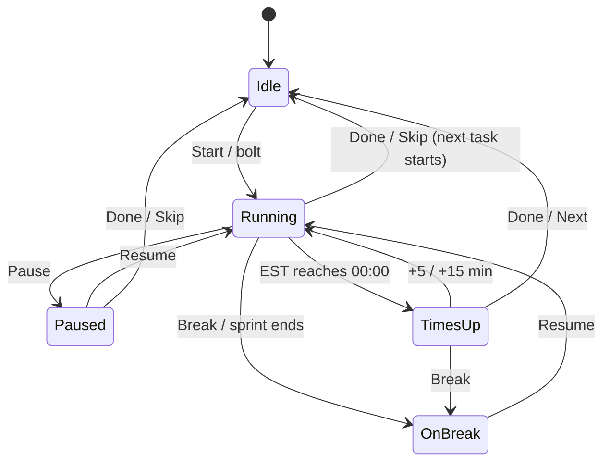
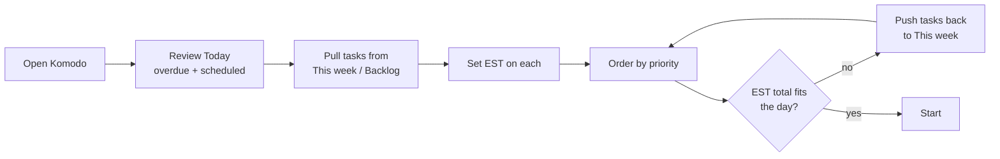
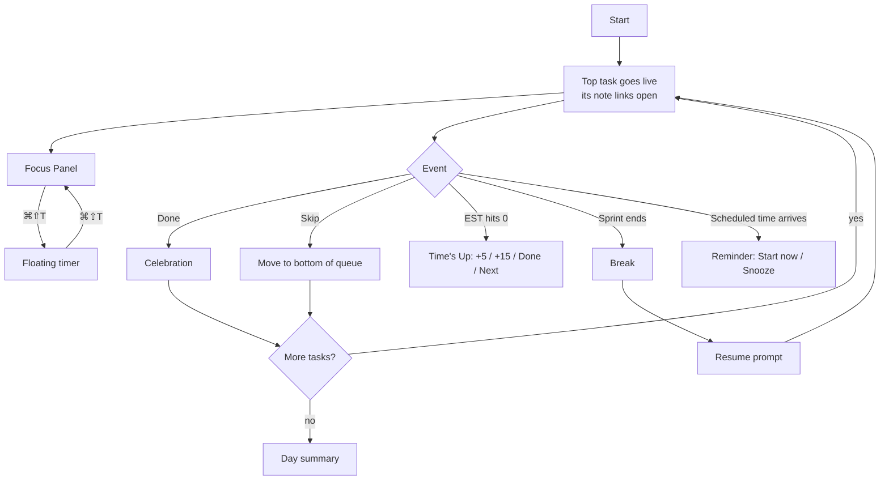

# Komodo: Features

> Komodo is a native macOS to-do list and focus timer for Apple silicon (macOS 14 Sonoma or later). It is local-only: there is no account and no server, and all data stays on the Mac.
> Its first feature is **Gmail → Calendar** (§4.0): Komodo reads Gmail and adds meetings and deadlines to Google Calendar. It never sends or changes email.
> Companion docs: [ARCHITECTURE.md](./ARCHITECTURE.md) · [DESIGN_SYSTEM.md](./DESIGN_SYSTEM.md)

---

## 1. Product

Komodo is a to-do list that collapses into a floating countdown timer. The current task stays visible above every app until it's done. Users plan a **Today** column with time estimates, press **Start**, and work top-down. Each completion starts the next task and plays a small celebration. Reports then compare estimated time against actual time.

**Core loop:** Plan the day → Start → focus on one task at a time → finish and review.

| Goal | How Komodo meets it |
| --- | --- |
| Never blocked by an outage | No server to go down. Data lives in SQLite on the Mac |
| Your data stays yours | Everything can be exported as a zip at any time (§4.21) |
| No duplicate tasks or events | Deterministic IDs for recurring tasks and calendar events |
| Email plans itself | Gmail → Calendar turns meetings and deadlines in email into events (§4.0) |
| Readable at a glance | AA-contrast colors (DESIGN_SYSTEM §2) |

## 2. Glossary

| Term | Meaning |
| --- | --- |
| **List** | A project or area, such as "Work". It has a name, a color, and an icon or letter badge |
| **Column** | A time horizon inside a list: **Backlog**, **This week**, **Today** |
| **Task** | A unit of work: title, EST, notes, subtasks, schedule |
| **EST** | Estimated duration, in HH:MM |
| **Time taken** | Actual tracked time, summed from sessions |
| **Focus mode** | Working through the Today column one task at a time |
| **Live task** | The task whose timer is running |
| **Focus Panel** | A narrow panel docked to the screen edge during Focus mode |
| **Floating timer** | A small always-on-top pill showing the live task and its time |
| **Session** | One continuous stretch of work or break on a task |
| **Sprint** | One Pomodoro work interval |
| **Time's Up** | The state when an EST countdown reaches 00:00 |
| **Punctuality** | How closely actual time matches EST |

## 3. Priorities

| Priority | Scope |
| --- | --- |
| **P0** | The core Mac app: Gmail → Calendar, lists, tasks, Focus mode, floating timer, Pomodoro, celebrations, zip backups |
| **P1** | Reports and sessions, recurring tasks, calendar import, Claude mode for Gmail, local MCP server, password-protected backups |
| **P2** | Komodo Assistant, voice notes, task-tool integrations |

---

## 4. Features

### 4.0 Gmail → Calendar (P0)

**Goal:** meetings, calls, appointments, and deadlines mentioned in email appear on Google Calendar without anyone copying them over. Komodo only **reads** Gmail. It never sends, replies to, deletes, labels, or marks email as read.

**Overlap with Google:** Google Calendar's "Events from Gmail" already adds flights, hotel and restaurant reservations, and ticketed events ([Google](https://support.google.com/calendar/answer/6084018)). Komodo covers everything else, such as "Can we meet Thursday at 3?" or "Submit by Oct 10". It skips reservations by default so events aren't duplicated.

**How it works**
1. **Connect:** Settings → **Gmail → Calendar** → **Connect Google**. Google's sign-in sheet asks for two permissions: *View your email messages and settings* (read-only) and *Make secondary calendars, and manage events on them*.
2. Komodo creates two calendars in the user's Google account:
   - **Komodo · From Gmail** for events it's confident about.
   - **Komodo · Review** for events it isn't sure about. The user keeps, moves, or deletes them in Google Calendar, or in Komodo's Review tab (P1).
3. **First scan:** emails from the last 3 days, followed by a summary such as "Added 4 events · 2 to review".
4. **Ongoing:** new inbox mail is checked every 2 minutes while Komodo runs (it stays in the menu bar). On launch or wake, Komodo catches up on everything since the last check, up to 7 days back.

**What's scanned:** mail matching the scan query (default `in:inbox newer_than:3d -category:promotions -category:social -category:forums`). These are skipped:
- Emails carrying a calendar invitation (`.ics`), because Google Calendar already handles invites.
- Newsletters (with a `List-Unsubscribe` header), unless the sender is on the allow list.
- Senders on the block list.
- Emails already processed.

**Extraction modes**

| Mode | What leaves the Mac | How it works | Default |
| --- | --- | --- | --- |
| **On this Mac** | Nothing beyond the Google API calls | Apple's on-device model on macOS 26+ with Apple Intelligence on. Otherwise, built-in date detection plus keyword rules | **On** |
| **Claude** (P1, opt-in) | Each email's subject and cleaned text go to Anthropic, using the user's own API key | Best with vague wording, several events in one email, and time zones | Off |

**Routing**

| Confidence | Goes to |
| --- | --- |
| High: a future date **and** time plus a meeting word, or a dated deadline | **Komodo · From Gmail** |
| Medium: a date is found but the time or intent is unclear | **Komodo · Review** |
| Low: nothing concrete, or only past dates | Nothing is added; the email is logged as "No event" |
| Reservations (flights, hotels, restaurants, tickets) | Skipped by default |

**The event Komodo creates**
- **Title:** the meeting or deadline in plain words. Deadlines are prefixed "Due: ".
- **Time:** relative words are resolved against **when the email arrived**. "Tomorrow at 3" in yesterday's email means today at 15:00. A time zone written in the email ("3pm PT") wins.
- **Duration:** 30 min for a meeting or call, 60 min for an appointment. A deadline with no time is an all-day event. A deadline with a time is a 15-min event ending at that time.
- **Location** and any meeting link (Meet, Zoom, Teams) are copied in.
- **Description:** "Added by Komodo from Gmail", then the sender, subject, the sentence the date came from, and an **Open email** link.

**Rules**
- **Never twice:** each email maps to fixed event IDs. Rescanning, or restoring a backup, never creates a second event.
- **Deleting is final:** an event the user deletes in Google Calendar is never added back.
- **No past events:** an event that has already started is never added.
- **No email is stored:** Komodo keeps only the message ID, received time, outcome, and the IDs of events it created.
- **Reschedules and cancellations (P1):** a later email in the same thread that moves or cancels the meeting updates or removes the event.
- **As tasks:** once calendar import is on (§5, P1), events from both Komodo calendars appear in Today and This week with reminders.

**Settings**

| Setting | Default |
| --- | --- |
| Extraction mode | On this Mac |
| Skip invitations · newsletters · reservations | On · On · On |
| Always scan / never scan these senders | Empty |
| Check every | 2 min |
| Default meeting length | 30 min |
| Scan query (under Advanced) | `in:inbox newer_than:3d -category:promotions -category:social -category:forums` |
| Pause scanning | Off |

**Activity log** (Settings → Gmail → Calendar → Activity) lists each scanned email with its outcome (**Added**, **Review**, **No event**, **Skipped** with the reason, or **Error**), plus **Open email**, **Open event**, and **Rescan** for errors.

**Acceptance**
- [ ] Connecting asks for exactly two Google permissions.
- [ ] "Can we meet Thursday at 3pm?" received on Tuesday creates a 30-min Thursday 15:00 event in **Komodo · From Gmail** within 5 minutes while Komodo runs.
- [ ] Rescanning an email, or restoring a backup, creates no duplicate event.
- [ ] An email with an `.ics` invitation creates nothing.
- [ ] Gmail is never modified: no read-state changes, labels, drafts, or sends.
- [ ] In On this Mac mode, no request goes to any host other than Google's APIs.
- [ ] After a 10-hour sleep, mail received in that time is processed within 1 minute of wake.

### 4.1 Lists (P0)

- Create a list from the **Create List** tile on Home or **+ Create new list** in the sidebar.
- A list has a name (1–60 characters), one of 8 colors, and an icon: an emoji, an image, or its first letter by default.
- Lists are reordered by dragging in the sidebar.
- **Archive** hides a list and its tasks everywhere except reports. **Delete** requires typing the list name and moves the list to Trash for 30 days.
- **All lists** shows every list merged into the same columns.

**Acceptance**
- [ ] A new list appears in the sidebar and opens with three empty columns.
- [ ] An archived list disappears from the sidebar, All lists, and search, and its report data remains.
- [ ] A deleted list and its tasks sit in Trash for 30 days, then are gone.

### 4.2 Columns and views (P0)

| Column | Holds | Automatic behavior |
| --- | --- | --- |
| **Backlog** | Work more than a week out | Unscheduled tasks stay where the user puts them |
| **This week** | Work for the current week (weeks start Monday by default) | Tasks dated later this week sit at the bottom |
| **Today** | Work for today; this column feeds Focus mode | Tasks dated today, or overdue, land here automatically |

The Today column has three sections:
1. **Up next**: unscheduled tasks in priority order. This is the focus queue.
2. **Scheduled tasks today**: tasks with a time today, sorted by that time.
3. **Done**: collapsed, showing the count and total time taken (e.g. "2 Done · 2hr 30min").

Above Today, a day summary shows **Est: 8hrs** (remaining EST), a progress bar, and **2/7 DONE**.

**Rules**
- A scheduled task's column is derived from its date: today or earlier → Today, this week → This week, later → Backlog.
- Dragging a scheduled task into another column clears its schedule, with a 5 s **Undo**.
- At midnight and on wake, columns update. Unfinished Today tasks stay in Today.

**Views:** a **single list** shows one list's columns. **All lists** merges every list, with each card showing its list badge.

### 4.3 Tasks (P0)

**Create**
- **+ ADD TASK** at the bottom of a column appends a task, and **+** in the column header inserts one at the top. ⌘⌥T opens quick add into Today.
- **Estimate in the title:** a trailing duration sets the EST and is removed from the title. `Email campaign 2hr 15min` becomes "Email campaign" with EST 02:15. Accepted forms: `2h`, `2hr`, `2 hrs`, `90m`, `90min`, `1h30`, `1:30`, `1.5h`. Only a trailing match counts, so "Read 2 chapters" is left alone.
- **Presets:** one-click EST chips while adding a task (15m / 30m / 1h by default, editable).

**Edit**
- Click the title to edit it. Return saves and Esc cancels.
- EST is set in the HH:MM field. **Time taken** can be edited only while the task isn't running.
- While a task is live, its title and EST are locked. Notes stay editable.

**Order and move**
- Drag within or across columns; order is priority. ⌥↑ / ⌥↓ move the focused card.
- **Move to list…** is in the card menu.

**Complete**
- Click the card's checkbox. In Focus mode, press **Done** (⌘⌥F), which plays the celebration (§4.13).
- Completed tasks move to **Done**, with a 5 s **Undo**. Unchecking a task restores it to its previous place.

**Card menu (⋯):** Schedule · Subtasks · Notes · Duplicate · Move to list · Archive · Delete.

**Acceptance**
- [ ] `Write spec 45m` + Return creates "Write spec" with EST 00:45.
- [ ] A card dragged to another column stays there after relaunch.
- [ ] Title and EST can't be edited while the task is live.

### 4.4 Subtasks (P0)

- Open with the Subtasks button on the card. Type and press Return to add; Return again adds the next one.
- Drag to reorder, click to rename, and use the trash button to delete.
- Checking subtasks fills the task's **progress dial** (done / total).
- Subtasks are fully editable on the live task in Focus mode.

### 4.5 Notes (P0; voice in P2)

- Rich text with bold, italic, underline, strikethrough, links, bulleted lists, numbered lists, and undo. **✕ Clear** removes formatting.
- Open from the card menu, or on the live task with ⌘⌥N.
- **Links in notes open automatically in the browser when the task goes live.** Only `http` and `https` links open, at most 5 per task, and a per-task toggle turns this off.
- **Voice note (P2):** the mic button records speech, which is transcribed on the Mac and added to the note.

### 4.6 Scheduling (P0)

- Open via card menu → **Schedule**.
- **Step 1, date:** **Today**, **Later today** (+2 h, which also sets a time), **Tomorrow**, **Next week**, or a date from the calendar. Then **Next**.
- **Step 2, time and repeat:** **+ ADD** a time (optional) and a repeat rule (§4.7).
- Without a time, the task appears in Today on its date. With a time, it shows that time, sits in **Scheduled tasks today**, fires a reminder (§4.12), and joins the focus queue once the time passes.

### 4.7 Recurring tasks (P1)

| Repeat | Rule |
| --- | --- |
| Every day | Mon–Sun |
| Every weekday | Mon–Fri |
| Weekly | Same weekday, e.g. "Every Thursday" |
| Monthly | Same day of the month, e.g. the 7th |
| Custom | Every **N** days, weeks, months, or years, with chosen weekdays |

- A recurring **parent** sits in Backlog and holds the rule. **Child** tasks for the current week are created each Monday and behave like normal scheduled tasks.
- **Replace existing tasks** deletes the unfinished children and recreates them from the new rule. Without it, existing children stay and new ones are added.
- **Doesn't repeat** + **Delete existing tasks** ends the recurrence.
- Children are created on launch, at midnight, and on Monday. Each child has a fixed ID, so creation never duplicates. A child is never created for a date before the rule existed.

### 4.8 Focus mode (P0)

**Start**
- Press **Start**, or use ⌘⇧B then Return.
- Eligible tasks are Today tasks with no time, or whose time has passed. They run top-down.
- The Home window hides, and the **Focus Panel** docks to the chosen screen edge.

**Focus Panel**
- Header: a list picker ("All ▾"), the title "Today", **Quick Settings** (gear), **Home** (exit Focus mode), and **Collapse** (switch to the floating timer).
- The day summary, then the **live task** with a gradient border and a large timer.
- The queue below stays fully editable. A **bolt** button on any card makes that task live, and the current task pauses and keeps its time.
- **Scheduled tasks today** and **Done** follow.

**Controls** (in the panel and on the floating timer)

| Control | Effect |
| --- | --- |
| Pause | Stops the clock. Resume starts a new session |
| Skip | Moves the live task to the bottom of Up next, keeping its time, and starts the next one |
| Done | Completes the task, celebrates, and starts the next eligible task |
| Break | Pauses the task and starts a break timer |
| Notes | Opens the live task's notes |

**End of queue:** after the last task, a "You won the day" summary shows tasks done, time focused, and EST accuracy.

**Acceptance**
- [ ] With 3 Today tasks, **Start** makes the first one live within 200 ms, ticking every second.
- [ ] **Done** on the last task shows the day summary and starts nothing.
- [ ] A task scheduled for 15:00 joins the queue at 15:00 and its reminder fires.

### 4.9 Floating timer (P0)

- A small pill with the live task's title and time. It floats above every app, including full-screen apps (a setting), appears on every Space, and can be dragged anywhere.
- ⌘⇧T switches between the panel and the timer. ⌘⇧P plays a locator animation.
- Long titles scroll when **Scrolling title** is on.
- Hovering shows the controls and an expand button.
- Its position is remembered per display. If that display disconnects, the timer moves to the main display.
- In Time's Up it turns red and counts overtime up (`+04:12`).
- The menu bar shows the remaining time next to the Komodo icon.

### 4.10 Timer modes (P0)

| EST set | Pomodoro on | Mode | Behavior |
| --- | --- | --- | --- |
| yes | no | **EST countdown** | Counts down. At 00:00 it shows **Time's Up** with **+5 min · +15 min · Done · Next** |
| any | yes | **Pomodoro** | Counts down a sprint, starts a break with a notification, then prompts to resume |
| no | no | **Time tracking** | Counts up |

Real elapsed time is always recorded. On completion, the card shows the result against EST, e.g. "12 min early".

### 4.11 Breaks and Pomodoro (P0)

- **Pomodoros**, with **Work sprint length** and **Break length** (defaults 25 / 5 min).
- **Default break length** (5 min) applies when Break is pressed by hand.
- Breaks are recorded as break sessions, so reports show break time.
- When a break ends, a sound and a notification play, and the panel shows **Resume [task]**. Nothing restarts on its own.

### 4.12 Reminders and alerts (P0; timed alerts P1)

- **Reminders:** a notification at a scheduled task's time, with **Start now** and **Snooze 5 min**. It fires even when Komodo isn't running.
- **Timed alerts** (P1): during a task, every N minutes (default 15, off by default), a soft sound plays and the timer optionally pulses.
- Sound choice and volume are in Settings.
- Calendar events imported as tasks get the same reminders.

### 4.13 Celebrations (P0)

Each is on by default and can be switched off:
- **Success screen:** a success message for about 2.5 s. Click to dismiss.
- **Fun GIF:** a random GIF from a bundled set, so it works offline.
- **Success sound**.
- **Streaks** (P1): consecutive days with at least one task done.
- Never shown mid-task. With Reduce Motion on, a still success card replaces the animation.

### 4.14 Reports (P1)

Every report filters by **list** (one or all) and **date range**.

| Report | Contents |
| --- | --- |
| **Overview** | Work days, tasks done, hours worked, average time per task. A daily chart of task hours, breaks, and total session time. **Most Productive Hour / Day / Month** |
| **Punctuality** | EST vs. actual per task, the share early, on time (±10%), or late, and the weekly trend |
| **Time spent** | Hours by list and by task |
| **Sessions** | A chronological log (§4.15) |

### 4.15 Sessions (P1)

- Every work or break stretch is a **session**: task, list, session number, date, start, end, and duration.
- Totals: **Total time**, tasks, and sessions. Filters: lists, **Show breaks**, and date range.
- Sessions can be edited or deleted, and **+ Add Session** logs work done away from the Mac.
- **Export PDF** and **Export CSV**.

### 4.16 Search (P0)

⌘F searches task titles, notes, and subtasks across all lists, including Done. Results are grouped by list, and Return opens the task.

### 4.17 Keyboard shortcuts (P0)

| Action | Shortcut | Scope |
| --- | --- | --- |
| Show Komodo | ⌘⇧B | Global |
| Toggle Focus Panel / floating timer | ⌘⇧T | Global |
| Find the floating timer | ⌘⇧P | Global |
| New task | ⌘⌥T | App |
| Start break | ⌘⌥B | App |
| Pause / resume | ⌘⌥P | App |
| Skip | ⌘⌥S | App |
| Done | ⌘⌥F | App |
| Notes on the live task | ⌘⌥N | App |
| Search | ⌘F | App |
| Settings | ⌘, | App |

Global shortcuts can be changed in Settings. A shortcut already taken by another app shows a warning.

### 4.18 Settings (P0)

| Section | Setting | Default |
| --- | --- | --- |
| General | Open at login | On |
| General | Show Komodo in the Dock | On (off makes it menu-bar only) |
| General | Show timer in the menu bar | On |
| General | Hide EST and time taken on cards | Off |
| General | Week starts on | Monday |
| General | Quick task presets | 15m, 30m, 1h |
| Focus | Panel screen · Panel side | Main display · Right |
| Focus | Float above full-screen apps | On |
| Focus | Workday ends (the Board says how the plan fits) | 6:00 PM |
| Focus | Pomodoros | On |
| Focus | Work sprint · break · default break | 25 · 5 · 5 min |
| Focus | Scrolling title | On |
| Focus | Open links in notes when a task starts | On |
| Alerts & sounds | Timed alerts during a task | Off (15 min, "Tick", pulse timer) |
| Alerts & sounds | Reminder sound · volume | "Chime" · 70% |
| Celebration | Success screen · GIF · sound | On · On · On |
| Shortcuts | Global shortcuts | As in §4.17 |

**Quick Settings** (the gear in the Focus Panel) holds Pomodoros, sprint and break lengths, panel side, and sounds on/off.

### 4.19 Komodo Assistant (P2)

- A chat button at the bottom right that takes **text or voice**.
- **Brain dump → tasks:** turns free text into tasks with titles, subtasks, notes, schedules, and ESTs, shown as an **editable preview** before anything is saved.
- **Edits:** renames tasks or lists, changes subtasks, notes, schedules, or ESTs, logs time, and moves tasks between lists or columns. `@Task name` targets a task.
- It runs on Apple's on-device model when available, and on Claude with the user's own key otherwise. It never writes directly: every change goes through the preview and can be undone.

### 4.20 Trash (P1)

Deleted lists and tasks stay in **Trash** for 30 days, with **Restore** and **Delete now** buttons, then disappear for good.

### 4.21 Backup and export (P0)

There is no Komodo account or server. Everything lives in one SQLite database on the Mac.

**Export:** Settings → Data & backup → **Export zip** saves `komodo-backup-YYYY-MM-DD.zip`:

| File | Contents |
| --- | --- |
| `manifest.json` | App version, schema version, export time, row counts |
| `komodo.sqlite` | A consistent copy of the whole database, for exact restores |
| `data.json` | Every list, task, subtask, recurrence, session, setting, and Gmail scan record, as readable JSON |
| `tasks.csv`, `sessions.csv` | For spreadsheets and invoicing |
| `assets/` | List icons |

- **No secrets:** Google tokens and API keys live in the macOS Keychain and are never exported. After a restore, the user reconnects Google once.
- **Automatic backups:** a daily zip to a chosen folder (default `~/Documents/Komodo Backups`), keeping the last 14. An iCloud Drive or Dropbox folder gives an off-Mac copy.
- **Restore:** Settings → Data & backup → **Restore from backup**. Komodo checks the file, backs up the current data, then replaces it.
- **New Mac:** export on the old Mac and restore on the new one.
- **Delete all data:** type DELETE to confirm. This wipes the database and disconnects Google.
- **Password-protected backups** (P1).

**Acceptance**
- [ ] Export → Delete all data → Restore gives back identical lists, tasks, sessions, and settings.
- [ ] The zip contains no token or API key.
- [ ] An automatic backup runs within 5 minutes of the first launch each day, and only 14 are kept.

---

## 5. Integrations

Every integration runs inside the app, and tokens are kept in the macOS Keychain. With no server, changes are fetched by **polling** while Komodo runs, with a catch-up on launch and wake. Each list can link one account per provider, and imported items are ordinary tasks.

| Provider | Direction | What syncs | Connect with | Priority |
| --- | --- | --- | --- | --- |
| **Gmail** | Reads Gmail, writes to Komodo's own calendars | Meetings and deadlines from email (§4.0) | Google sign-in | **P0** |
| Google Calendar | Calendar → Komodo | Events become tasks with title, time, description, and Meet link. Choice of calendars, range (up to 3 weeks), all or accepted events | Google sign-in | P1 |
| Microsoft Calendar | Calendar → Komodo | Same as Google Calendar | Microsoft sign-in | P1 |
| Notion | Two-way | A database. Title, date, Status → column, checkbox properties → subtasks | Personal token | P2 |
| Todoist | Two-way | One project | Personal token | P2 |
| Linear | Linear → Komodo | A team's issues, optionally one project | Personal token | P2 |
| ClickUp | Two-way | Spaces, folders, lists. Title, dates, EST, status | Personal token | P2 |
| Asana | Two-way | Projects. Title, subtasks, notes, dates, completion | Personal token | P2 |

**Common settings**

| Setting | Meaning |
| --- | --- |
| **Auto sync** | Poll for changes automatically |
| **Sync now** | Pull changes immediately |
| **Sync deletes** | Deleting in Komodo also deletes at the provider. Deleting at the provider only unlinks the task in Komodo, keeping its notes and sessions |
| **Only my items** | Import only items assigned to the user |
| **Date mapping** | Which provider date sets the schedule: start or due |
| **Status mapping** | Which provider statuses map to which column, and to Done |

Imported tasks are placed by date: none or beyond this week → Backlog, this week → This week, today → Today.

### 5.1 Local MCP server (P1)

Komodo includes an MCP server that Claude Desktop, Claude Code, and Raycast can launch on the same Mac. It works while Komodo is running, needs no login, and sends nothing through any Komodo server. The MCP client asks the user before each tool call.

| Tool | Purpose |
| --- | --- |
| `list_lists` | Lists with IDs |
| `list_tasks` | Filter by list, column, date, and status |
| `create_task` | Title, list, column, EST, notes, subtasks, schedule |
| `update_task` | Any field, including moving between columns or lists |
| `complete_task` / `complete_subtask` | Mark done |
| `log_time` | Add a manual session |
| `start_focus` | Make a task live in Komodo |

---

## 6. User flows

### 6.1 Onboarding (P0)
1. Three intro screens: plan, focus, win.
2. Allow notifications (Komodo suggests the **Alerts** style so reminder buttons show).
3. "What do you want to finish today?": each typed line becomes a Today task.
4. Optional: **Connect Gmail → Calendar**, which can be skipped and set up later.
5. A tip pointing at **Start**.

### 6.2 Plan the day (P0)

### 6.3 Focus session (P0)

### 6.4 End of day (P1)
1. Day summary: tasks done, time focused, EST accuracy, streak.
2. Unfinished tasks: **Tomorrow** (default) or **This week**.
3. A link to Reports.

---

## 7. Out of scope

- Sending, replying to, deleting, or labeling email.
- Accounts, a server, sync between devices, and mobile or web apps.
- Team features: shared lists, assignments, comments.
- Project-management depth: dependencies, Gantt charts, custom fields.
- Billing.
- Windows, Linux, and Intel Macs.
